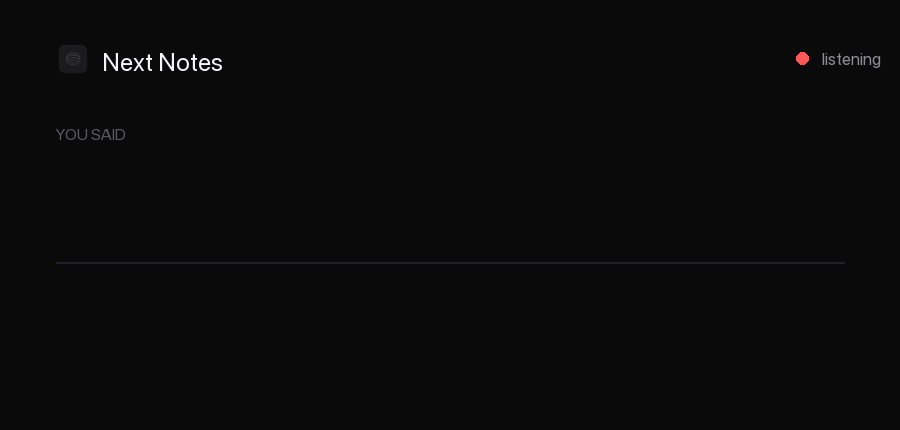

# Next Notes

Push-to-talk dictation for macOS. Hold a key, talk, release — cleaned-up text lands in the
app you were already in. A Wispr Flow-shaped app, built native and fully on-device.



**Status:** the macOS app is in daily use. It supports Apple and Parakeet transcription,
deterministic or on-device LLM cleanup, per-app output formatting, personal dictionary bias
and corrections, and an opt-in voice Command Mode for editing selected text. Dictated text
returns to the app it was started in, even if you switch away while the model is still
working. It also records meetings: the
microphone and the system's own output are captured as two separate tracks and transcribed
separately, which is where the "You" and "Others" attribution in a meeting transcript comes
from. A finished recording then walks itself the rest of the way — tell the speakers on the
system track apart, write Granola-style notes with a local LLM, and offer follow-up actions
in Gmail, Calendar, Drive and Docs that only happen if you approve them. Everything runs on
this Mac; the only network traffic is a model download, your own calendar, and a Workspace
action you approved. The Windows app builds and is exercised in CI, but has not yet been
used for a real microphone/key/injection session on Windows hardware.

**Meetings record themselves by default.** Once Calendar access is granted, Next Notes reads
your calendars (Apple Calendar through EventKit, and optionally Google Calendar through its
API), and any event that looks like a real meeting — a conference link or at least one other
attendee, not all-day, not declined — is armed a minute before it starts and recorded when
it does. It announces itself first with a notification carrying **Record now** and **Skip**,
every event has its own Record checkbox in the Upcoming list, and the whole behaviour is one
switch in Settings ▸ Meetings (*Record calendar meetings automatically*, with the lead time
beside it). Turn that off and meetings only record when you press the button.

**A call nobody put on a calendar arms the same card.** Core Audio's process list says which
processes hold the microphone and the speakers at once, which is what separates a call from
dictation (microphone only) and from watching a video (speakers only). When one settles,
Next Notes raises the same armed card a calendar meeting raises — **Record now** and **Skip**,
under the notch and in a notification — and records nothing until it is answered. Settings ▸
Meetings ▸ **Calls** holds the switch (*Notice when I'm on a call*) and the choice between
*Ask before recording* and *Start recording*; asking is the default on purpose, because a
calendar meeting was agreed to in advance, an ad-hoc call was not, and consent law for
recording one varies by jurisdiction. Under it, **every app that has actually held your
microphone** gets its own *Always record* / *Ask first* / *Never* — a list built from what
has happened on this Mac, so no bundle identifier is ever typed in, and empty until something
uses the microphone. A browser is only ever asked about: Chrome holding the microphone might
be a Meet call and might be any other tab, so *Always record* isn't offered for one, while
Meet installed as a Chrome app has its own identity and is not restricted. A call that is
already covered by an armed or recording meeting attaches to it rather than starting a second
recording of the same conversation, and nothing is armed at all without the Microphone
grant.

**Pressing Stop is not the end of a meeting.** The session writes the transcript and hands
the meeting to a pipeline that runs on its own: optionally identify the speakers on the
system track, then write the notes, then — if the Workspace agent is enabled — read the
notes and propose what to do about them. Each stage has its own status in the meeting list
(*Identifying speakers*, *Writing notes*), so the Record button comes back long before the
Notes tab fills in.

**The island.** On a MacBook with a notch, the Next Notes status lives in a small card
hugging it — what is being dictated, a meeting about to start with **Record now** /
**Skip**, the elapsed recording, notes being written, and an agent proposal with
**Approve** / **Dismiss**. Hover expands it. On a display without a notch it is a floating
capsule under the menu bar, and Settings ▸ Dictation can put dictation back on the old
bottom-of-screen HUD instead.

---

## Coexisting with another dictation app

This app is built to run alongside other dictation tools without colliding with them, which
is not automatic on macOS and is worth understanding before changing anything:

- **Bundle ID `ai.pivotstudio.nextnotes`** — TCC keys Accessibility and Microphone
  grants to the bundle ID, so granting or revoking a permission here has no effect on any
  other app, and vice versa.
- **Executable `NextNotes`** — one word, no space, so `pkill -x NextNotes` matches this
  binary and nothing else. The bundle is `Next Notes.app`; only the binary inside it is
  spelled as one word. The `Makefile` only ever targets `$(EXEC)`.
- **Hotkey is configurable** (Right ⌥ / fn / Right ⌘) precisely because another tool may
  already own the key you'd reach for first. The event tap inspects only its own keycode
  and passes everything else through untouched.

If you run more than one dictation app, give each a different push-to-talk key. Two apps on
the same key both record, and whichever injects text will fight the other.

---

## Quick start

```bash
make install     # builds, bundles, signs, copies to /Applications, launches
```

Then grant these permissions — none is optional, and none can be requested silently:

| Permission | Where | Needed for |
|---|---|---|
| **Accessibility** | System Settings ▸ Privacy & Security ▸ Accessibility | The `CGEventTap` that sees the hotkey, and the AX text insert |
| **Microphone** | Prompted on first dictation | Audio capture |
| **Audio Recording** | System Settings ▸ Privacy & Security ▸ Audio Recording, after the first meeting | The process tap that records what the other people in a meeting say |
| **Calendar** | Prompted from Settings ▸ Calendar, or the onboarding checklist | Reading which meetings are coming up, so they can record themselves |
| **Notifications** | Prompted at first launch | The armed-meeting alert, "notes are ready", and agent proposals |

Audio Recording is the odd one out: there is no API to ask whether it was granted, and a
tap without it succeeds and returns pure silence rather than an error. So the Permissions
checklist shows that row as unanswerable, and a flat "Others" meter during a meeting is the
only symptom you will get. `--selftest-systemaudio` reports `SYSTEM_AUDIO_SILENT` for the
same reason, and `tccutil reset AudioCapture ai.pivotstudio.nextnotes` resets that one row.

Restart Next Notes after granting Accessibility. Then hold **Right ⌥** and talk.

### How rebuilds affect grants

TCC stores a *code-signing requirement* per entry, not just a path. An ad-hoc signature
changes on every build, so the rebuilt binary stops satisfying the stored requirement —
and the symptom is nasty: the Accessibility toggle still **shows as on** while the app is
reported untrusted, and flipping it changes nothing because the stale row is the problem.

The `Makefile` auto-detects a stable Developer ID through `security find-identity` and falls
back to ad-hoc signing. Developer ID builds retain their grants across rebuilds. Ad-hoc builds
need a fresh Accessibility grant after each rebuild; Next Notes now detects that the event tap
did not arm, shows the repair action, and retries automatically after the grant is restored.

If a grant ever does get wedged, reset that one row and re-add — never toggle:

```bash
tccutil reset Accessibility ai.pivotstudio.nextnotes
tccutil reset Microphone   ai.pivotstudio.nextnotes
```

Always pass the bundle ID. A bare `tccutil reset Accessibility` wipes **every** app on the
machine. Then quit System Settings entirely (⌘Q) before reopening — that pane caches its
list and will otherwise show the row you just deleted.

> **Keep the build out of iCloud.** `~/Desktop` and `~/Documents` are file-provider synced
> on this machine; the sync engine can materialize/dematerialize files inside an `.app` and
> corrupt its signature. `make install` puts the running copy in `/Applications`.

Other targets: `make app` (bundle only), `make run` (run in place), `make clean`.

---

## Architecture

```
 hold key ─► HotkeyMonitor ──► DictationController ◄── Settings
                                │
                     ┌──────────┼──────────┐
                     ▼          ▼          ▼
              AudioCapture  HUDPanel   TranscriptionEngine
                     │                      │
                (AudioChunk) ──ordered──► AppleSpeechEngine
                                            │
                                       (transcript)
                                            ▼
                                      TextFormatter
                                            ▼
                                      TextInjector ─► origin app

 selected text ─► Command hotkey ─► speech command ─► Foundation Model
                                                              │
                                                              └─► guarded replacement

 calendar ─► CalendarService ─► MeetingScheduler ─► MeetingController
                                                          │
                                              ┌───────────┴───────────┐
                                              ▼                       ▼
                                        AudioCapture          SystemAudioCapture
                                          (You)                    (Others)
                                              │                       │
                                        ChunkedTranscriber ──────────┘
                                              │ (Parakeet, one queue)
                                              ▼
                                        MeetingPipeline
                                              │
                          ┌───────────────────┼───────────────────┐
                          ▼                   ▼                   ▼
                  DiarizationService    NotesService        AgentService
                  (speaker labels)      (local LLM)      (proposals, approved
                                                          one at a time)
```

### Decisions worth knowing

**The HUD must never take focus.** `HUDPanel` is a `.nonactivatingPanel` with
`canBecomeKey == false`. This is the load-bearing detail of the whole app: if the overlay
took key status, the user's text field would lose focus and there'd be nothing left to
inject into. Everything else is replaceable; this isn't.

**The hotkey needs a `CGEventTap`, not `NSEvent`.** `fn` and left/right modifier
discrimination don't surface through `NSEvent.addGlobalMonitorForEvents` or the Carbon
hotkey API. A session event tap is the only way to see them — which is why Accessibility
permission is a hard requirement rather than a nicety.

**Audio ordering is explicit.** `AudioCapture` yields into an `AsyncStream` drained by a
single task. Spawning a `Task` per buffer would be simpler and would silently corrupt the
transcript, because unstructured tasks have no ordering guarantee.

**Buffers are copied, never borrowed.** `AVAudioEngine` recycles the buffer it hands to a
tap the instant the callback returns. `AudioChunk`'s `@unchecked Sendable` is only sound
because `AudioCapture` always allocates fresh storage before handing off.

**Three swappable seams.** `TranscriptionEngine`, `TextFormatter`, and
`TextCommandProcessor` are protocols so speech recognition, transcript cleanup, and selected
text editing can change providers without rewiring capture or injection.

### Layout

```
Sources/NextNotes/
├── NextNotesApp.swift              @main, AppDelegate, MenuBarExtra
├── Core/
│   ├── DictationController.swift   state machine, wires everything
│   ├── HotkeyMonitor.swift         CGEventTap on .flagsChanged
│   ├── AudioCapture.swift          AVAudioEngine tap on the microphone
│   ├── SystemAudioCapture.swift    Core Audio process tap on everything the Mac plays
│   ├── AudioConversion.swift       format conversion + RMS, shared by both captures
│   └── TextInjector.swift          AX selection capture/insert, pasteboard+⌘V fallback
├── Transcription/
│   ├── TranscriptionEngine.swift   protocol + AudioChunk
│   ├── AppleSpeechEngine.swift     SpeechAnalyzer / SpeechTranscriber
│   └── ParakeetEngine.swift        local FluidAudio/CoreML batch ASR
├── Context/
│   ├── ScreenContext.swift         CandidateName + CandidateKind: what a harvest found
│   ├── ScreenContextStore.swift    one walk per hold, started at key-down, awaited twice
│   ├── AXHarvester.swift           the budgeted tree walk itself
│   ├── AXAppAdapters.swift         the three editors, by bundle id, hand-tested
│   └── ContextPrivacyFilter.swift  what is never read: secure fields, URL bars, finance apps
├── Dictionary/
│   └── DictionaryStore.swift       the user's own corrections, and the ASR bias list
├── Formatting/
│   ├── TextFormatter.swift         protocol + RuleBasedFormatter
│   ├── FoundationModelFormatter.swift
│   ├── S1MiniFormatter.swift       local llama.cpp cleanup
│   ├── FoundationModelCommandProcessor.swift
│   ├── CleanupInstructions.swift   the cleanup prompt, including the grounding block
│   ├── Targets/                    OutputProfile (+PathReferenceStyle), OutputProfileStore,
│   │                               OutputFormatInstructions, InstalledApps
│   └── LLM/
│       ├── LlamaBackend.swift      one llama.cpp backend for both local models
│       ├── LlamaHelpers.swift      tokenize/detokenize/batch, shared
│       ├── LLMProvider.swift       protocol + LLMProviderID, provider resolution
│       ├── NotesModels.swift       the Qwen3.5-4B ModelSpec
│       ├── NotesModelRuntime.swift the notes model, Metal-offloaded, self-unloading
│       ├── LlamaLLMProvider.swift  Qwen behind the protocol
│       └── FoundationModelLLMProvider.swift   Apple's on-device model behind it
├── Calendar/
│   ├── CalendarProvider.swift      MeetingEvent + the protocol both accounts implement
│   ├── CalendarService.swift       every enabled calendar merged, polled, deduped
│   ├── EventKitCalendarProvider.swift  the Mac's own calendars
│   ├── ConferenceURLDetector.swift Zoom/Meet/Teams/Webex links in a location or note
│   ├── FakeCalendarProvider.swift  --fake-calendar: one meeting 90 seconds out
│   └── Google/                     OAuth (PKCE + loopback), Keychain token store,
│                                   DTOs, and the Calendar API provider
├── Meetings/
│   ├── MeetingModels.swift         Meeting, MeetingStatus, TranscriptSegment, AudioSource
│   ├── MeetingStore.swift          one directory per meeting under Application Support
│   ├── ChunkedTranscriber.swift    cuts a live track into windows, one per audio source
│   ├── MeetingAudioWriter.swift    stereo CAF, left = you, right = everyone else
│   ├── MeetingSession.swift        one recording: both captures, both transcribers
│   ├── MeetingScheduler.swift      arms, starts and stops calendar meetings on a 30 s tick
│   ├── CallPolicy.swift            the pure rules: both flags, self, denylist, debounce
│   ├── CallDetector.swift          watches Core Audio's process list for a live call
│   ├── MeetingController.swift     the single place a meeting starts or stops
│   ├── MeetingPipeline.swift       what happens after the last window: diarize, then notes
│   ├── MeetingDiarizer.swift       FluidAudio clustering over the system track
│   ├── DiarizationService.swift    owns the .diarizing → next transition, per meeting
│   ├── NotesPrompts.swift          every prompt and the five headings
│   ├── NotesGenerator.swift        single pass, or map/reduce when the transcript is long
│   └── NotesService.swift          owns the .summarizing → .done transition
├── Agent/
│   ├── GoogleWorkspaceCLI.swift    locates `gws`, reads its auth state, runs it
│   ├── WorkspaceTools.swift        the eleven-tool catalogue and its risk classes
│   ├── WorkspaceToolRunner.swift   the only place a `gws` write is performed
│   ├── AgentModels.swift           AgentRisk, AgentProposal, AgentActionRecord
│   ├── AgentPrompts.swift, AgentToolCall.swift, LLMProviderTools.swift
│   ├── MeetingAgent.swift          plans over notes + transcript, returns proposals
│   ├── AgentService.swift          files, announces, and executes approved proposals
│   └── WorkspaceInstaller.swift    writes the .command scripts Terminal opens
├── UI/
│   ├── DesignSystem.swift          every colour, size, radius, duration token
│   ├── MainWindow.swift            NavigationSplitView shell
│   ├── Sidebar.swift               section list, plus the live "Recording" row
│   ├── HUDPanel.swift              non-activating floating panel
│   ├── HUDView.swift               capsule: red dot + level bar + transcript, glass
│   ├── Island/                     IslandGeometry (where the notch is), IslandPanel,
│   │                               IslandState (what to show), IslandView
│   ├── Components/                 LevelMeter (+LevelBar), RecordingIndicator,
│   │                               ModelStatusRow, CopyButton, StatusChip, MarkdownView,
│   │                               ProblemBanner, FlowLayout, ThinkingOrbs/,
│   │                               OrbBackdrop, DottedField, GlassSurface,
│   │                               LabeledOrb, SectionHeading, OrbUnavailableView
│   ├── Dictation/                  DictationView, TranscriptionRow
│   ├── Dictionary/                 DictionaryPanel
│   ├── Comparison/                 ComparisonView
│   ├── Meetings/                   MeetingsView, MeetingLiveView, MeetingDetailView,
│   │                               TranscriptView, MeetingActionsView,
│   │                               ProposalArgumentsSheet, SpeakerNamesSheet
│   ├── Onboarding/                 PermissionsChecklist, OnboardingSheet
│   └── Settings/                   SettingsWindow + one Form per tab: General, Dictation,
│                                   Meetings, Calendar, Workspace, Models, Permissions
└── Support/
    ├── Settings.swift, LocalModelStore.swift, Permissions.swift, Log.swift
    ├── ModelDownloader.swift       one ModelSpec download path with progress + SHA-256
    ├── Notifications.swift         armed meetings, notes ready, agent proposals, and
    │                               the action buttons on each
    └── NavigationState.swift       which section is showing
```

### Self-tests

Each flag runs one thing and exits, so a subsystem can be answered from a terminal instead
of by using the app. Run them from the installed bundle:

```bash
S="/Applications/Next Notes.app/Contents/MacOS/NextNotes"

"$S" --selftest-s1                      # S1-mini cleanup through the shared llama.cpp backend
"$S" --selftest-parakeet                # Parakeet loads and transcribes a silent second
"$S" --selftest-systemaudio             # 3 s process tap: frames, format, peak, RMS
"$S" --selftest-transcribe <wav>        # WAV → ChunkedTranscriber → segments JSON + RTF
"$S" --selftest-calendar                # provider states, deduped events, auto-record rules
"$S" --selftest-notes <wav> [--diarize] # transcribe → notes; prints tok/s and peak RSS
"$S" --selftest-llm-metal               # a Metal runtime and a CPU runtime in one process
"$S" --selftest-calls                   # who holds mic + speakers now, and every CallPolicy rule
#                                         including arming: correlation, the grant guard, ask-first
"$S" --selftest-island                  # island geometry per display, panel invariants, states
"$S" --selftest-orb                     # the four ThinkingOrb modes at both sizes
"$S" --selftest-gws                     # locate `gws`, read its version and auth state
"$S" --selftest-agent <meeting-dir>     # proposals as JSON; executes nothing
"$S" --selftest-dictation               # every way a hold can go wrong still ends at idle
"$S" --selftest-context [bundle-id]     # harvest an editor's window: names, paths, ms,
#                                         the grounding block, and what stopped the walk
```

Each prints a single `<NAME>_OK` or `<NAME>_FAILED` line last, so they can be read by a
script. Two are worth knowing about in detail:

`--selftest-dictation` is the one that guards the tail. It drives `DictationController`
with a real microphone but a fake engine: an engine whose `finish()` never returns, one that
leaves its transcript stream open, and one so slow to start that the key is released before
it is ready. Each has to come back to `.idle` and say what went wrong. Unbounded — which is
what the tail used to be — the first two park the controller in `.finishing`, and the HUD
and the island both draw that as a live recording, which is what "it looks stuck and it
keeps recording in the background" is a description of.

`--selftest-context` is the only way to find out whether the screen-name harvest works,
because nothing else can: CI cannot build this target, the tests reach only the
platform-neutral scoring in `NextNotesDictionary`, and the equivalent log line needs a real
hold with a microphone and grammar-repair cleanup. It defaults to Cursor and takes any
bundle identifier with an adapter. **It fails on a stub tree**, which is the normal state of
a fresh VS Code fork: those editors expose nothing until `editor.accessibilitySupport` is
set to `on`, and the failure line is the sentence that says so.

`--selftest-calendar` prints each provider's state, what it would record out of the next
day, and the result of running the auto-record rules over invented events — that last half
needs no account and no grant, so a change that starts recording declined invitations or
all-day blocks fails it anywhere. `--selftest-agent` likewise checks the tool catalogue,
the `<tool_call>` parser and the risk gate without a Google account, so it is runnable on a
machine where `gws` was never signed in.

`--fake-calendar` is not a self-test but a modifier: it replaces every real provider with
one invented meeting starting 90 seconds out, so the whole armed → notified → recording →
done path can be watched without waiting for a real meeting. It never runs alongside the
real calendars, so a test can't record something that is actually happening.

---

## Meetings

A meeting is a directory under `~/Library/Application Support/Next Notes/Meetings/<uuid>/`
holding `meeting.json`, `transcript.json`, `notes.md`, `proposals.json` and — while one is
needed — `audio.caf`. Nothing about a meeting lives only in memory, which is what lets the
app be quit in the middle of one and repair it at the next launch.

**Two tracks, never a mixdown.** The microphone and a Core Audio process tap on everything
the Mac plays are captured, transcribed and stored separately, and that is where "You" and
"Others" come from. `ChunkedTranscriber` cuts each track into windows — the first pause
after 30 seconds, hard cut at 60 — and one `TranscriptionQueue` serialises Parakeet across
both. The known cost of using the built-in microphone with laptop speakers is that remote
voices bleed onto the mic track.

**Speakers.** With *Tell the other speakers apart* on (Settings ▸ Meetings), FluidAudio's
offline diarizer clusters the system track after the recording and the clusters are mapped
onto transcript segments by overlap, giving *Speaker 1…n* — renamable, with the invite's
attendees offered as suggestions. Labels land per sentence: a transcription window is split
on pauses and sentence endings before it is stored, so each turn carries its own speaker
rather than the whole window taking whoever held most of it.

**Notes.** `NotesGenerator` writes markdown under five fixed headings — Summary, Key
points, Decisions, Action items, Open questions — in one pass when the transcript fits the
model's context, and otherwise by mapping chunks to attributed facts and reducing them.
Two providers are interchangeable and either can be picked per meeting from **Regenerate**:

| Provider | Where it runs | Context | Notes |
|---|---|---|---|
| **Qwen3.5-4B Q4_K_M** (default) | bundled llama.cpp, Metal | up to 32K here | 2.74 GB download from Settings ▸ Models; frees itself ten minutes after the last generation |
| **Apple Foundation Models** | the OS | 4096 tokens | no download; long transcripts always take the map/reduce path |

Notes are written automatically when a recording finishes (*Write notes when a meeting
ends*), and **Regenerate** rewrites them with either provider afterwards.

---

## The Workspace agent

Optional, off until you turn it on, and it is a proposer rather than an actor. After a
meeting — and, if *Watch during the meeting* is on, every two minutes during one — the same
local LLM reads the notes and transcript and returns proposals: create a Doc with the notes,
email the action items to the people who were on the invite, put a dated follow-up on the
calendar. They appear in the meeting's **Actions** tab, on the island, and as a notification.

Tools are performed by Google's [`gws` CLI](https://github.com/googleworkspace/cli), which
Settings ▸ Workspace installs and signs in through Terminal — four states, each with the one
next step it needs. Nothing is silent: `gws` is never installed, authorised or signed into
behind your back, and the tab shows the whole catalogue.

Every tool is graded by what cannot be taken back, and the grade decides who presses the
button:

| Class | Tools | Behaviour |
|---|---|---|
| **read** | `search_email`, `get_agenda`, `find_drive_files`, `read_doc` | Run by the agent itself while it plans, if *Let it look things up* is on |
| **write** | `create_doc`, `append_doc`, `upload_to_drive`, `create_event`, `draft_email` | One approval each |
| **send** | `send_email`, `reply_email` | One approval each, with the full message shown first, and only from the Actions tab |

Arguments are editable before approval, results (a document link, an event, a message id)
are recorded on the meeting, and an unanswered proposal survives a quit.

---

## Speech engine

Default is Apple's **`SpeechAnalyzer` / `SpeechTranscriber`**, new in macOS 26: no
dependency, no bundled model, no cloud path, real streaming with `.volatileResults` so
text appears while you're still talking. The OS downloads and manages model assets, so the
first run for a locale may pause on `AssetInstallationRequest`.

The other built-in choice is **Parakeet v3** via FluidAudio and CoreML. Next Notes validates
every required model artifact before marking it ready and prepares it when selected. The
encoder currently uses deterministic CPU placement because accelerator compilation can
stall or wedge on macOS 26.
Both engines feed the same cleanup, dictionary, history, and injection pipeline.

| | Apple SpeechTranscriber | Parakeet v3 (FluidAudio) |
|---|---|---|
| Dependency | none | SwiftPM |
| Model download | OS-managed | one-time, about 470 MB |
| Processing | streaming | batch on key release |
| Compute | OS-managed | local CoreML, CPU placement |

---

## Formatting, dictionary, and Command Mode

- **Rule-based cleanup** removes common fillers, interprets spoken line/paragraph markers,
  fixes spacing, capitalizes sentences, and adds terminal punctuation.
- **On-device cleanup** is selectable in Settings. Apple's Foundation Models formatter
  handles false starts, spoken self-corrections, paragraphing, and list formatting. S1-mini
  by Superwhisper is an embedded open-weight transcript normalizer; Next Notes downloads its
  462 MiB Q4 model once, verifies its SHA-256 digest, and runs it through the bundled
  llama.cpp runtime with no network request during formatting. Both fall back to the
  deterministic pass when unavailable or unsuccessful.
- **Cleanup controls** expose five user-facing tone positions, list formatting, and a
  general/email context. S1-mini natively has four controls, so Balanced maps to its
  semi-formal control; the Apple formatter receives all five directly.
- **Personal dictionary** entries are supplied to Apple Speech as short
  `AnalysisContext.contextualStrings` before audio arrives. Correction pairs then run
  deterministically after cleanup on both macOS and Windows. This implements names and short
  jargon; pronunciation-trained `SFCustomLanguageModelData` models are not built.
- **Per-app output profiles** decide which formatting marks the cleanup pass is allowed to
  emit. `formatting.txt` in Application Support maps a bundle identifier to what that app can
  actually render — Slack takes bullets and fenced code but shows a pipe table as pipes;
  Obsidian renders all of it; Terminal renders none — and Settings ▸ Formatting edits the same
  table. **An app with no row gets plain prose**, deliberately: emitting `**bold**` into
  something that shows the asterisks is worse than emitting nothing. The profile is resolved
  from the app that was frontmost when the key went down, not the one frontmost when the text
  lands, and it overrides *Format spoken lists* — a list the target renders as literal hyphens
  is worse than the prose it replaced. S1-mini is the one engine this cannot reach, because it
  takes no instructions at all; with grammar repair on, the second pass is a general-purpose
  model and honours it.
- **Where the text goes** is the app you started dictating into. Transcription and cleanup take
  seconds and you are free to move on inside them, so the target is captured at key-down and
  returned to at insertion. Settings ▸ Dictation chooses what happens when you *have* moved:
  switch back and insert (the default), insert wherever you now are, or copy to the clipboard
  and disturb nothing. If the original app cannot be brought back — it quit — the text is left
  on the clipboard and the HUD says so, rather than vanishing.
- **Learning from your corrections.** Any past dictation in the list can be corrected in
  place. The diff between what the engine wrote and what you changed it to is read by
  `CorrectionLearner` and proposed as dictionary rules — `Kajo` → `Kadjo`, `cloud code` →
  `Claude Code`, `vercel` → `Vercel`. Settings ▸ Dictation chooses whether to ask, file them
  silently, or learn nothing. The original transcript is kept beside the edit rather than
  overwritten, because the pair is the evidence.

  Most of what the diff finds is thrown away, and that is the point: a rule fires on every
  future transcript, so learning "I think" → "we should" from someone rewriting a sentence is
  worse than learning nothing. Pairs must be one to three words a side, must not be a very
  common word, and must be similar enough to read as a mis-hearing rather than a rephrasing.
  An edit that yields more than five candidates was a rewrite, and yields none.
  `--selftest-learn` covers the rejections as well as the acceptances.

  **This deliberately does not watch the app the text landed in.** That was the first design,
  and `--selftest-axreadback` killed it: Cursor, Chrome, Terminal, Messages, ChatGPT and Claude
  expose *zero* readable text elements, so it would have fired almost nowhere while reading the
  user's text in every app. Reading a run back out of our own history works everywhere and
  watches nothing.
- **Command Mode** is opt-in. Select editable text, hold its independently configured second
  hotkey, and speak an instruction such as "make this more formal." Next Notes snapshots the
  AX selection, applies the instruction with Apple's on-device model, and replaces it only if
  focus and selection are unchanged. A timeout/model failure leaves the source text intact.

## Landing page

The site source is `site/` — Vite, React, TypeScript, Tailwind and Framer Motion. **There is
no `build/` or `dist/` folder.** Vite is pointed at `docs/` instead, and `docs/` is what gets
served. Live at <https://next-notes.com>.

**Production is DigitalOcean Apps, not GitHub Pages.** The app is `nextnotes`, a static site
whose `source_dir` is `docs`, with `deploy_on_push` on `main` and **no build command of its
own** — it serves the committed `docs/` verbatim. That is why the build output has to be in
version control: it is not a convenience, it is the deployed artifact. It is also why
`npm run deploy` finishes by polling <https://next-notes.com> rather than a Pages URL.
`doctl apps list-deployments e2366c03-b11d-4c56-8d07-fdea08b21cdc` shows what shipped.
GitHub Pages served this site before the move and has been switched off, so there is exactly
one live copy and one URL to reason about.

**`site/public/` is copied verbatim** and holds everything a crawler asks for by convention
rather than by link: `robots.txt`, `sitemap.xml`, `llms.txt`, `favicon.ico`,
`apple-touch-icon.png`, `og-image.png` and the demo GIF above.

Two rules about that metadata, both learned the hard way:

- **`og:image`, `og:url` and the canonical must be absolute.** Open Graph consumers resolve
  them server-side, with no page context to resolve a relative path against, so `./icon.png`
  was simply dropped and every link to the site previewed bare. `base` is `"./"` for the
  bundle, which makes the contrast easy to miss.
- **The card must be at least 300px wide** for `twitter:card: summary_large_image`. It used to
  point at the 256px app icon, which fails that minimum, so the card had no image even when
  the URL resolved. It is now a 1200×630 render.

The page is a client-rendered React app, so a crawler that does not run JavaScript receives
`<div id="root"></div>` and nothing else. Search engines cope; the assistant crawlers this
project cares about mostly do not. The static `<noscript>` block and the JSON-LD in
`index.html` exist for them and must keep saying what the rendered page says. Prerendering the
route at build time is the real fix and is not done.

```bash
cd site && npm install     # once
npm run dev                # local preview
npm run deploy             # build, commit docs/, push, and confirm it went live
```

`npm run deploy` is the whole sequence and the only one worth remembering. It takes an
optional message — `npm run deploy -- "Rewrite the hero"` — and it:

1. refuses unless you are on `main`, since that is the branch DigitalOcean watches;
2. refuses if `origin` is the upstream repository this project was started from;
3. builds;
4. commits `docs/` **and only `docs/`**, so anything else half-staged in the tree is not
   swept into a "Rebuild the site" commit;
5. pushes;
6. fetches the live page and waits until it serves the bundle just built.

Step 6 is the point. A push is not a deployment: App Platform rebuilds asynchronously and
takes a minute or two, so the only honest confirmation is the live URL serving the new hash.
The script exits non-zero if it never does.

**Asset paths are relative (`base: "./"`), and must stay that way** unless you are certain
the site will only ever be served from a domain root. An absolute `/` base 404s every asset
when the same build is served from a subpath — which is exactly what happened to the Pages
copy. `./` resolves against whatever URL the page was loaded from, so one build is correct in
both places.

**Where the build goes, and why it is committed.** `docs/` is build output, tracked on
purpose. Editing it by hand works right up until the next build silently discards the change
— edit `site/src/` instead. Publishing is a commit, not a CI run: App Platform watches
`main` and republishes `docs/` exactly as committed. No workflow, no Actions minutes, and
whatever was previewed locally is byte-for-byte what ships. The two workflows in
`.github/workflows/` build the macOS and Windows apps and have nothing to do with the site.

The cost of that choice is build output in version control, which makes diffs noisy. The
benefit is that a deploy can be verified locally before it ships, and there is no CI to be
broken by something unrelated.

Two details in `site/vite.config.ts` that look like oversights and are not. `base` is `"./"`
and not `/` for the reason just given — next-notes.com is a domain root, but the same build
still has to work under the old Pages subpath. And `emptyOutDir` is **false**: `docs/` also
holds `PARAKEET-WINDOWS.md` and `S1-MINI-WINDOWS.md`, which are linked from this file,
`AGENTS.md` and `windows/README.md`, so wiping the directory would delete them and break
four links. The build script clears `docs/assets` instead, which is the only part that
accumulates stale hashed bundles.

The orb on the page is not a picture. `site/src/components/Orb.tsx` is the `listening`
geometry ported from `OrbGeometry.swift` with the same preset resolved at the same size, so
the sphere on the site and the sphere at the notch are the same object. It freezes on the
same frame the app does when Reduce Motion is on. There is no stock photography or video
anywhere on the page, and nothing is hotlinked.

The page claims no download, because there is no signed release to download — it points at
this repository instead. If a release ever ships, the call to action is the thing to change.

## Not built yet

1. **Claude cleanup/command provider.** The formatter and command processor have seams for a
   server-backed higher-quality tier, but no credential storage, consent UI, or network path
   is present.
2. **Windows local cleanup.** S1-mini by Superwhisper is a strong candidate; the integration
   design and constraints are in [`docs/S1-MINI-WINDOWS.md`](docs/S1-MINI-WINDOWS.md).
3. **Notarization and Windows distribution signing.** Local macOS builds use a stable
   Developer ID when available, but neither platform has a complete distribution pipeline.
4. **Meetings on Windows.** Everything from the process tap onwards is macOS-only; the
   Windows app is still dictation.

### Written but never exercised end to end

Every one of these compiles, has a self-test where a self-test is possible, and has never
had the one real thing it needs:

- **The system-audio tap with its grant.** `--selftest-systemaudio` has only ever reported
  `SYSTEM_AUDIO_SILENT` here, and no recording has yet contained an "Others" track.
- **Returning the text to the app it came from.** `TextInjector.Origin` and the switch-away
  setting are written and the state machine is covered by `--selftest-dictation`, but that
  harness stubs the insert seam. The activation path — `NSRunningApplication.activate()`, the
  `kAXFrontmostAttribute` fallback, and the polling behind both — has never run against a real
  app switch, because it needs a real hold and the Accessibility grant. `Log.inject` says which
  branch was taken.
- **Per-app output profiles reaching the model.** Wired from `captureTarget()` through to the
  cleanup prompt and verified by reading each link, but never observed end to end for the same
  reason. `output target: <app>` in the log at key-down is the proof when it runs.
- **Apple Calendar (EventKit).** `--selftest-calendar` reports `eventKit: Not connected`.
  macOS prompts exactly once, so a dismissed prompt is permanent until
  `tccutil reset Calendar ai.pivotstudio.nextnotes` puts it back to undecided.

- **Workspace writes.** `gws` reports no credentials on this machine, so no proposal has
  ever been approved and no Doc, event or email has been created by the agent.

---

## Verified

Driven with a synthetic Right ⌥ hold (`scratchpad/ptt/ptt2.swift` posts `flagsChanged`
events) and confirmed via `/usr/bin/log show --predicate 'subsystem ==
"ai.pivotstudio.nextnotes"'`:

- Builds clean under Swift 6 strict concurrency.
- Signs with Developer ID when one is installed, and otherwise with the stable self-signed
  "Next Notes Local Signing" certificate that `make signing-cert` creates. That certificate is
  the whole reason grants stick: two consecutive builds produce an identical designated
  requirement, so macOS does not treat the rebuilt app as a different one. Genuinely ad-hoc
  builds — no certificate at all — do require a fresh Accessibility grant every rebuild.
- Qwen3.5-4B downloaded, SHA-256 pinned, and running on Metal with real weights alongside
  S1-mini on the CPU in one process.
- Google Calendar connected through the OAuth loopback flow, with the refresh token in the
  Keychain: `--selftest-calendar` reports `google: Connected` and returns real events.
- The system-audio tap runs with its grant — `system audio started — tap 48000Hz → engine
  16000Hz`. A recording containing an actual "Others" track is still unconfirmed.
- Launches as a regular macOS app with its main window and menu bar item present.
- Event tap arms on grant without a restart (the poller catches it).
- Full state machine: `starting → listening → finishing → idle`, no errors.
- `SpeechAnalyzer` starts; models already installed, no download stall.
- Audio capture runs and converts native 48 kHz → 16 kHz for the engine.
- HUD renders bottom-center, at the size `DS.Size.hud` names, without taking focus.
- Silence produces an empty transcript and injects nothing.
- A WAV goes through `ChunkedTranscriber` to segments, and those segments to notes with all
  five headings (`--selftest-notes`).
- A Metal-offloaded llama.cpp runtime and a CPU one are alive and correct in one process
  (`--selftest-llm-metal`) — the gate on sharing one backend between the two local models.
- The island panel appears at the right frame on each attached display, never becomes key,
  and passes clicks through outside its own rectangle (`--selftest-island`).
- The auto-record rules over invented events, and the agent's tool catalogue, parser and
  risk gate (`--selftest-calendar`, `--selftest-agent`) — both need no account.

**Nobody has looked at the redesigned UI or the island on screen.** The self-tests prove
geometry and behaviour, not appearance: hover-to-expand, the growth out of the notch, the
sidebar in light and dark, and the onboarding sheet are all unverified by eye.

**Command Mode still needs a manual app-compatibility pass.** AX selection reading is only
available in editable accessibility text elements, and Electron/browser editors vary in how
faithfully they implement it. The implementation refuses to replace text when the captured
selection cannot be revalidated.

> `log` is shadowed in this shell — use `/usr/bin/log` explicitly or it returns nothing.
