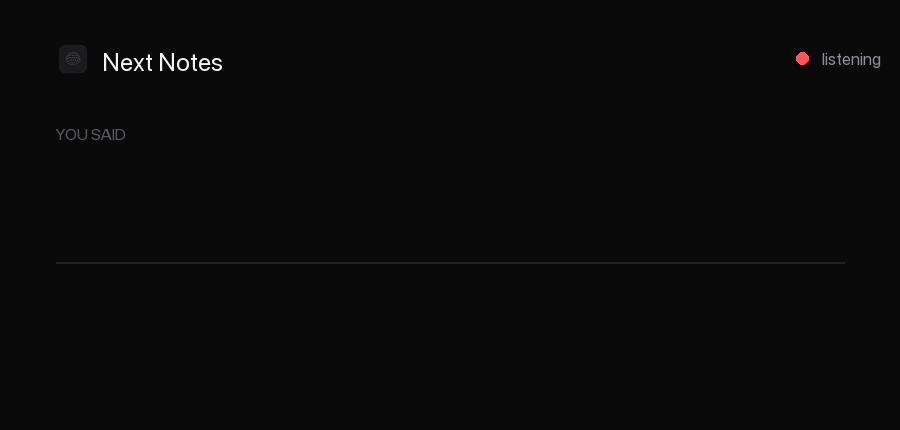

# Next Notes

Your Mac is the only agent you need. Hold a key, talk, release — cleaned-up text lands in the app you were
already in. Meetings record themselves. ⇧⌘ Space asks the same machine to click, search
or follow through. A Wispr Flow-shaped native app with on-device defaults and optional cloud models.



**Free software, [AGPL-3.0-or-later](LICENSE).** Read it, build it, fork it — modified
versions stay open, including ones run as a service. See [License](#license).

**Status:** the macOS app is in daily use. It supports Apple and Parakeet transcription,
deterministic or on-device LLM cleanup, per-app output formatting, personal dictionary bias
and corrections, and an opt-in voice Command Mode for editing selected text. Dictated text
returns to the app it was started in, even if you switch away while the model is still
working. It also records meetings: the
microphone and the system's own output are captured as two separate tracks and transcribed
separately, which is where the "You" and "Others" attribution in a meeting transcript comes
from. A finished recording then walks itself the rest of the way — tell the speakers on the
system track apart, write Granola-style notes with a chosen local or OpenRouter model, and offer follow-up actions
in Gmail, Calendar, Drive and Docs that only happen if you approve them. A meeting that was
interrupted is resumed rather than written off, and a recording kept only for a pipeline
stage is released 72 hours later rather than immediately. **Meeting panel** (⌘⇧M) opens over
a meeting that is still running: your own notes, what the app heard you agree to, earlier
meetings worth looking at, and a way to ask about this one. Separately, ⇧⌘ Space
or “Hey Next” opens a conversation with the same Mac: silence ends a turn, Done leaves the
session, and it can inspect the frontmost window, click and type after you approve, search
files, run a shell command (never sudo), or hand longer work to a coding CLI you already
have installed. The agent answers on a local model that is verified to produce a token
before anything is switched to it, chooses tools by what you asked for rather than by word
overlap, and reads your own meetings, notes and conversations through an index that is on by
default. Optional MCP servers and Composio sit behind the same permission broker;
native Workspace tools stay on `gws`. OpenRouter is opt-in: when chosen for Agent or notes,
the relevant prompts and transcripts are sent to its cloud API and may incur charges.
A read-only path into your own Messages database is in place behind Full Disk Access, with a
Settings row that reports what it can actually read; **the iMessage command channel itself is
not built** — see [Not built yet](#not-built-yet).
The Windows app is dictation only: it builds and is
exercised in CI, but has not yet been used for a real microphone/key/injection session on
Windows hardware.

**What we optimize for.** Three things, in this order. **Speed and fluency** — a hold answers
at key-down, a voice turn listens while it speaks, and a long job shows its state instead of a
still screen. **Simplicity** — the app does the work itself rather than handing you an API key, a
command line or a config file, and every screen says what a person would say out loud.
**Control** — anything that creates, sends or deletes waits for one approval, and the card shows
exactly what will happen before it does. The engineering form of this, and the rules an agent
working on this repo follows, is [AGENTS.md](AGENTS.md) § *What we optimize for*.

**Meetings record themselves by default.** Once Calendar access is granted, Next Notes reads
your calendars (Apple Calendar through EventKit, and optionally Google Calendar through its
API), and any event that looks like a real meeting — a conference link or at least one other
attendee, not all-day, not declined — is armed a minute before it starts and recorded when
it does. It announces itself first with a notification carrying **Record now** and **Skip**,
every event has its own Record checkbox in the Upcoming list, and the whole behaviour is one
switch in Settings ▸ Meetings (*Record calendar meetings automatically*, with the lead time
beside it). Turn that off and meetings only record when you press the button.

**A call nobody put on a calendar arms the same card.** Core Audio's process list says which
processes hold the microphone and the speakers at once, which is what separates a call from
dictation (microphone only) and from watching a video (speakers only). When one settles,
Next Notes raises the same armed card a calendar meeting raises — **Record now** and **Skip**,
under the notch and in a notification — and records nothing until it is answered. Settings ▸
Meetings ▸ **Calls** holds the switch (*Notice when I'm on a call*) and the choice between
*Ask before recording* and *Start recording*; asking is the default on purpose, because a
calendar meeting was agreed to in advance, an ad-hoc call was not, and consent law for
recording one varies by jurisdiction. Under it, **every app that has actually held your
microphone** gets its own *Always record* / *Ask first* / *Never* — a list built from what
has happened on this Mac, so no bundle identifier is ever typed in, and empty until something
uses the microphone. A browser is only ever asked about: Chrome holding the microphone might
be a Meet call and might be any other tab, so *Always record* isn't offered for one, while
Meet installed as a Chrome app has its own identity and is not restricted. A call that is
already covered by an armed or recording meeting attaches to it rather than starting a second
recording of the same conversation, and nothing is armed at all without the Microphone
grant.

**Pressing Stop is not the end of a meeting.** The session writes the transcript and hands
the meeting to a pipeline that runs on its own: optionally identify the speakers on the
system track, then write the notes, then — if the Workspace agent is enabled — read the
notes and propose what to do about them. Each stage has its own status in the meeting list
(*Identifying speakers*, *Writing notes*), so the Record button comes back long before the
Notes tab fills in. A meeting interrupted by a quit or a crash is repaired and resumed at the
stage it reached, and both model stages carry a stall watchdog, so a pass that stops making
progress is cancelled into a plain problem and **keeps its recording** so the retry has
something to read.

**You can open a panel over a meeting that is still running.** **Meeting panel** (⌘⇧M, or
the button beside Stop) is a rail of four sections over the live meeting: **Notes** is what
you type yourself, tidied into a document when you press Keep and never written over the
model's `notes.md`; **Actions** is what the app heard you agree to, with the quoted
evidence; **History** is earlier meetings by the same people or the same subject, each row
carrying the reason it is there and saying plainly when the switch that answers it is off;
**Ask** is the same agent, reading the meeting through its own tools. One floating primary
action and one status row sit over the content. The panel has been built and pinned by
self-test but **has never been seen by an eye** — see
[Written but never exercised](#written-but-never-exercised-end-to-end).

**The island.** On a MacBook with a notch, the Next Notes status lives in a small card
hugging it — what is being dictated, a meeting about to start with **Record now** /
**Skip**, the elapsed recording, notes being written, an agent conversation (silence
ends a turn; **Done** leaves), and an agent proposal with **Approve** / **Dismiss**.
Hover expands it. On a display without a notch it is a floating
capsule under the menu bar, and Settings ▸ Dictation can put dictation back on the old
bottom-of-screen HUD instead.

---

## Coexisting with another dictation app

This app is built to run alongside other dictation tools without colliding with them, which
is not automatic on macOS and is worth understanding before changing anything:

- **Bundle ID `ai.pivotstudio.nextnotes`** — TCC keys Accessibility and Microphone
  grants to the bundle ID, so granting or revoking a permission here has no effect on any
  other app, and vice versa.
- **Executable `NextNotes`** — one word, no space, so `pkill -x NextNotes` matches this
  binary and nothing else. The bundle is `Next Notes.app`; only the binary inside it is
  spelled as one word. The `Makefile` only ever targets `$(EXEC)`.
- **Hotkey is configurable** (Right ⌥ / fn / Right ⌘) precisely because another tool may
  already own the key you'd reach for first. The event tap inspects only its own keycode
  and passes everything else through untouched.

If you run more than one dictation app, give each a different push-to-talk key. Two apps on
the same key both record, and whichever injects text will fight the other.

---

## Quick start

```bash
make install     # builds, bundles, signs, copies to /Applications, launches
make install OPEN=0   # same, but do not auto-open (agents must use this)
```

Agents running self-tests must never launch the GUI from install. After `OPEN=0`:

```bash
Scripts/run-selftest.sh --selftest-orb
# TCC-sensitive:
Scripts/run-selftest.sh --via-open --selftest-systemaudio
```

Then grant these permissions — none is optional, and none can be requested silently:

| Permission | Where | Needed for |
|---|---|---|
| **Accessibility** | System Settings ▸ Privacy & Security ▸ Accessibility | The `CGEventTap` that sees the hotkey, and the AX text insert |
| **Microphone** | Prompted on first dictation | Audio capture |
| **Audio Recording** | System Settings ▸ Privacy & Security ▸ Audio Recording, after the first meeting | The process tap that records what the other people in a meeting say |
| **Calendar** | Prompted from Settings ▸ Calendar, or the onboarding checklist | Reading which meetings are coming up, so they can record themselves |
| **Notifications** | Prompted at first launch | The armed-meeting alert, "notes are ready", and agent proposals |
| **Full Disk Access** | Optional, from Settings ▸ Agent ▸ Messages | Reading your own Messages database. Nothing works without it today — the row exists so the read path has a switch rather than appearing from nowhere later |

Audio Recording is the odd one out: there is no API to ask whether it was granted, and a
tap without it succeeds and returns pure silence rather than an error. So the Permissions
checklist shows that row as unanswerable, and a flat "Others" meter during a meeting is the
only symptom you will get. `--selftest-systemaudio` reports `SYSTEM_AUDIO_SILENT` for the
same reason, and `tccutil reset AudioCapture ai.pivotstudio.nextnotes` resets that one row.
Full Disk Access is the second odd one: it has no prompt and no query API either, so the
Settings row answers by **reading one row out of the real database** — a checkmark that can
only come out of a real read, and that a self-test can therefore hold to a standard.

Restart Next Notes after granting Accessibility. Then hold **Right ⌥** and talk.

### Optional OpenRouter models

**Model ownership direction (2026-09-30; shared-file integration planned):** Meetings, Agent
and dictation cleanup keep independent model choices. They reuse a single verified
model file when they select the exact same artifact; different versions or
quantizations are separate files. Module setup offers only missing files, and turning
one module off keeps files another module or running job needs. Cloud consent stays
specific to the workload. Dictation cleanup offers MiniCPM5-2B as a picker row since
2026-09-30, with Apple guarding and falling back from the original transcript —
decided by the head-to-head in `Tests/Reports/MODEL-COMPARE-CLEANUP-2026-09-30.md`
(MiniCPM5-2B 3/42 assertions at 0.59 s median vs Apple 0/42 at 3.03 s, Qwen3-4B 8/42
at 1.61 s). The current implementation still selects Apple for an unset fresh-install
preference. The owner's requested direction is MiniCPM as the preferred cleanup
default when its verified file is available, with Apple providing the no-download
fallback when it is absent or cannot safely run. Preserve existing explicit choices;
the cleanup executor must pin that default behavior in its tests. The agent model is untouched by all of this: cleanup pins its own
file and the agent role resolves exactly as before.
This direction does not claim the shared-file resolver or module activation gates have shipped.
The implementation contracts live in the local SHARED-BRAIN and MODULES-ACTIVATION
roadmaps; the existing runtime's residency limits still apply during migration.

In Settings ▸ Models, enter an OpenRouter API key. It is stored in the macOS Keychain.
Then choose OpenRouter separately in Settings ▸ Agent and Settings ▸ Meetings. Each model
picker searches OpenRouter's live catalog and filters by text output, tool support,
reasoning, vision, free variants and provider; it shows context length and published
input/output prices. Agent answers and meeting notes can use different cloud models.
Gemma 4 E4B and Apple Foundation Model remain available as local choices. An OpenRouter
selection with a missing key or model reports an error instead of silently changing providers.
The Agent and meeting model pickers offer an OpenRouter speed rank using its recent
throughput ranking. Visible models show the fastest provider's reported 30-minute median
output tokens per second when available; a dash means OpenRouter supplied no rate. These
figures are estimates, not a guarantee for a particular request or provider route. The
numeric rates can differ from the order of OpenRouter's routing-based model ranking.

### Agent voice

Settings ▸ Models ▸ Speech synthesis has one compact choice for macOS voices, Pocket TTS,
or Kokoro 82M. Only the chosen engine's voice controls appear; one button previews the
voice and changes to Stop preview while it plays. Pocket has four local voices and downloads
its model when selected. Kokoro uses FluidAudio's Core ML model and its Heart voice; it is
disabled on macOS 26.4–26.5 because Apple Core ML can crash during synthesis on those
versions. It becomes selectable on macOS 26.6 and later. The older Kokoro ONNX files in
`~/Library/Caches/NextNotesTTS/kokoro-model` were for a benchmark and are not the Core ML
model used for Agent speech. Pocket TTS by [Kyutai](https://huggingface.co/kyutai/pocket-tts)
is CC BY 4.0; [Kokoro 82M Core ML](https://huggingface.co/FluidInference/kokoro-82m-coreml)
is Apache 2.0.

The Agent keeps listening while it speaks and accepts interruptions. Playback
echo is filtered from recognized text, and rendered output PCM also feeds local
SpeexDSP echo cancellation before recognition. Physical speaker-echo tests have
passed on this Mac, but cold overlapping speech and reliable early interruption
remain acceptance gates. The bundled WebRTC AEC3 path is an explicit self-test
candidate until those gates pass. Measurements and limits are in
`Tests/Reports/acoustic-echo.md` and `Tests/Reports/voice-conversation-analysis-2026-09-14.md`.

### How rebuilds affect grants

TCC stores a *code-signing requirement* per entry, not just a path. An ad-hoc signature
changes on every build, so the rebuilt binary stops satisfying the stored requirement —
and the symptom is nasty: the Accessibility toggle still **shows as on** while the app is
reported untrusted, and flipping it changes nothing because the stale row is the problem.

The `Makefile` auto-detects a stable Developer ID through `security find-identity` and falls
back to ad-hoc signing. Developer ID builds retain their grants across rebuilds. Ad-hoc builds
need a fresh Accessibility grant after each rebuild; Next Notes now detects that the event tap
did not arm, shows the repair action, and retries automatically after the grant is restored.

If a grant ever does get wedged, reset that one row and re-add — never toggle:

```bash
tccutil reset Accessibility ai.pivotstudio.nextnotes
tccutil reset Microphone   ai.pivotstudio.nextnotes
```

Always pass the bundle ID. A bare `tccutil reset Accessibility` wipes **every** app on the
machine. Then quit System Settings entirely (⌘Q) before reopening — that pane caches its
list and will otherwise show the row you just deleted.

> **Keep the build out of iCloud.** `~/Desktop` and `~/Documents` are file-provider synced
> on this machine; the sync engine can materialize/dematerialize files inside an `.app` and
> corrupt its signature. `make install` puts the running copy in `/Applications`.

Other targets: `make app` (bundle only), `make run` (run in place), `make test` (the shared
vectors and nothing else), `make selftest SELFTEST_ARGS='…'`, `make acceptance [TIER=core]`,
`make gates` (the evidence-gate report in the foreground), `make icon`, `make dmg`
(release build + drag-to-Applications disk image), `make signing-cert`, `make clean`.

A `v*` tag on `main` runs `.github/workflows/release.yml`, which builds that same
DMG on `macos-26` and attaches `NextNotes-$VERSION.dmg` and a stable `NextNotes.dmg`
to the GitHub Release. The website's Download button points at
`/releases/latest/download/NextNotes.dmg`. The image is not notarized — there is no
Developer ID in CI yet — so the first open is right-click the app and choose Open.
Do not commit the DMG; it lives on the Release, not in `docs/`.

---

## Architecture

```
 hold key ─► HotkeyMonitor ──► DictationController ◄── Settings
                                │
                     ┌──────────┼──────────┐
                     ▼          ▼          ▼
              AudioCapture  HUDPanel   TranscriptionEngine
                     │                      │
                (AudioChunk) ──ordered──► AppleSpeechEngine
                                            │
                                       (transcript)
                              ┌─────────────┴─────────────┐
                              ▼                           ▼
                     IncrementalCleanup          CleanupRouter
                     (while the key is down)      (SpokenStructure, guard, budget)
                              └─────────────┬─────────────┘
                                            ▼
                                      TextFormatter
                                            ▼
                                      TextInjector ─► origin app

 selected text ─► Command hotkey ─► speech command ─► Foundation Model
                                                              │
                                                              └─► guarded replacement

 calendar ─► CalendarService ─► MeetingScheduler ─► MeetingController
                                                          │
                                              ┌───────────┴───────────┐
                                              ▼                       ▼
                                        AudioCapture          SystemAudioCapture
                                          (You)                    (Others)
                                              │                       │
                                        ChunkedTranscriber ──────────┘
                                              │ (Parakeet, one queue)
                                              ▼
                                        MeetingPipeline
                                              │
                          ┌───────────────────┼───────────────────┐
                          ▼                   ▼                   ▼
                  DiarizationService    NotesService        AgentService
                  (speaker labels)      (local LLM)      (proposals, approved
                                                          one at a time)
                          │                   │
                          └─────────┬─────────┘
                                    ▼
                        MeetingFinalPass (long windows, after Stop)
                        MeetingResumer   (a quit mid-meeting resumes)
                        MeetingConsole   (⌘⇧M over the live meeting)

 ⇧⌘ Space / “Hey Next” ─► ActivationController ─► AgentCaptureController
                                                      │
                                                      ▼
                                                RealtimeAgent
                                                      │
                                           AgentCapabilityManifest
                                           (what this turn may do)
                                                      │
              ┌──────────────┬────────────────────────┼──────────────┬─────────────┐
              ▼              ▼                        ▼              ▼             ▼
        Computer         Files / shell         WorkspaceToolRunner  ACP         MCP
        (AX ids)         (no sudo)             (gws, approved)     (optional)  (optional)
```

Four rules hold that diagram together, and each of them is a place the obvious design fails
silently:

- **One answer to what a turn may do.** `AgentCapabilityManifest` is built once per planner
  turn and answers for the schema, the rules, the grounding sentence, the execution check,
  "what can you do" and the voice gates at once. Four of those used to be separate answers
  that disagreed.
- **One thing starts audio.** Only `OutputScheduler` may, enforced by a token whose
  initializer is private to its file — so "no backend independently decides to speak" is a
  compile error rather than a convention.
- **One task ledger, one tool catalogue, one usage log.** A second copy of any of them fails
  silently rather than loudly, which is the expensive kind of bug.
- **Nothing reaches the network through a shared cache.** Every provider carrying model or
  account data uses an ephemeral session; the shared one wrote a full model stream to disk,
  where it outlived the turn.

The [September 14 voice analysis](Tests/Reports/voice-conversation-analysis-2026-09-14.md)
traces the latest conversation through the local model, work lifecycle, and playback.
Apple Foundation Models handles local conversation independently of on-device background
workers. Side questions keep work intact; targeted corrections revise the relevant task.
Announcements wait for a quiet interval and retry unfinished clauses after interruption.
Local Parakeet EOU detects turn endings, and actual rendered PCM feeds SpeexDSP echo
cancellation before Agent recognition. The measured speech replay and Apple speaker/mic
probe pass; first-response latency under model contention and human double-talk quality
remain explicit acceptance questions in that analysis.

### Decisions worth knowing

**The HUD must never take focus.** `HUDPanel` is a `.nonactivatingPanel` with
`canBecomeKey == false`. This is the load-bearing detail of the whole app: if the overlay
took key status, the user's text field would lose focus and there'd be nothing left to
inject into. Everything else is replaceable; this isn't.

**The hotkey needs a `CGEventTap`, not `NSEvent`.** `fn` and left/right modifier
discrimination don't surface through `NSEvent.addGlobalMonitorForEvents` or the Carbon
hotkey API. A session event tap is the only way to see them — which is why Accessibility
permission is a hard requirement rather than a nicety.

**Audio ordering is explicit.** `AudioCapture` yields into an `AsyncStream` drained by a
single task. Spawning a `Task` per buffer would be simpler and would silently corrupt the
transcript, because unstructured tasks have no ordering guarantee.

**Buffers are copied, never borrowed.** `AVAudioEngine` recycles the buffer it hands to a
tap the instant the callback returns. `AudioChunk`'s `@unchecked Sendable` is only sound
because `AudioCapture` always allocates fresh storage before handing off.

**Three swappable seams.** `TranscriptionEngine`, `TextFormatter`, and
`TextCommandProcessor` are protocols so speech recognition, transcript cleanup, and selected
text editing can change providers without rewiring capture or injection.

### Layout

```
Sources/NextNotes/
├── NextNotesApp.swift              @main, AppDelegate, MenuBarExtra
├── Core/
│   ├── DictationController.swift   state machine, wires everything
│   ├── HotkeyMonitor.swift         CGEventTap on .flagsChanged
│   ├── AudioCapture.swift          AVAudioEngine tap on the microphone
│   ├── AudioCaptureHub.swift       one mic engine serves dictation, wake and meetings
│   ├── SystemAudioCapture.swift    Core Audio process tap on everything the Mac plays
│   ├── AudioConversion.swift       format conversion + RMS, shared by both captures
│   ├── TextInjector.swift          AX selection capture/insert, pasteboard+⌘V fallback
│   └── Compute/                    ComputeJob + ComputeScheduler: one on-device lane,
│                                   resumable, and the residency policy above it
├── Transcription/
│   ├── TranscriptionEngine.swift   protocol + AudioChunk
│   ├── AppleSpeechEngine.swift     SpeechAnalyzer / SpeechTranscriber
│   └── ParakeetEngine.swift        local FluidAudio/CoreML batch ASR
├── Context/
│   ├── ScreenContext.swift         CandidateName + CandidateKind: what a harvest found
│   ├── ScreenContextStore.swift    one walk per hold, started at key-down, awaited twice
│   ├── AXHarvester.swift           the budgeted tree walk itself
│   ├── AXAppAdapters.swift         the three editors, by bundle id, hand-tested
│   ├── ContextPrivacyFilter.swift  what is never read: secure fields, URL bars, finance apps
│   ├── ComputerContext.swift       front app, window, clipboard, project — as references
│   └── ContextEngine.swift         meeting + computer context, resolved on demand
├── Dictionary/
│   └── DictionaryStore.swift       the user's own corrections, and the ASR bias list
├── Formatting/
│   ├── TextFormatter.swift         protocol + RuleBasedFormatter
│   ├── FoundationModelFormatter.swift
│   ├── S1MiniFormatter.swift       local llama.cpp cleanup
│   ├── MiniCPMCleanupFormatter.swift MiniCPM5-2B pinned by file, Apple as guard+fallback
│   ├── FoundationModelCommandProcessor.swift
│   ├── CleanupInstructions.swift   the cleanup prompt, including the grounding block
│   ├── SpokenStructure.swift       spoken lists/quotes/code/tables rendered in code, not
│   │                               by a prompt — runs either side of the model
│   ├── SentenceChunker.swift       long holds split into sentence groups, whole-pass budget
│   ├── CleanupTrace.swift          what actually happened to one dictation: engine, route,
│   │                               guard verdict, fallback reason — filed on the run
│   ├── IncrementalCleanup.swift    the sentences that stopped changing are tidied while the
│   │                               key is still down; the key-up pass only cleans the tail
│   ├── CleanupRouter.swift         the deterministic SpokenStructure stage, the whole-pass
│   │                               budget, and the pre-clean head the router accepts
│   ├── ChatTemplate.swift          per-family templates; MiniCPM5's tool delimiters are
│   │                               control tokens and are rendered here, not by the runtime
│   ├── PrefixReuse.swift           keep the KV cache across calls; decode only the tail
│   ├── LlamaArchitectures.swift    the supported-architecture table, generated from the
│   │                               pinned llama.cpp tag; a valid GGUF can still be unopenable
│   ├── Targets/                    OutputProfile (+PathReferenceStyle), OutputProfileStore,
│   │                               OutputFormatInstructions, InstalledApps
│   └── LLM/
│       ├── LlamaBackend.swift      one llama.cpp backend for both local models
│       ├── LlamaHelpers.swift      tokenize/detokenize/batch, shared
│       ├── LLMProvider.swift       protocol + LLMProviderID, provider resolution
│       ├── NotesModels.swift       the built-in (Gemma 4 E4B) ModelSpec
│       ├── NotesModelRuntime.swift the notes model, Metal-offloaded, self-unloading
│       ├── LlamaLLMProvider.swift  on-device model behind the protocol
│       ├── FoundationModelLLMProvider.swift   Apple's on-device model behind it
│       ├── OpenAICompatibleLLMProvider.swift  Ollama / LM Studio / any loopback server,
│       │                               including the structured-tool-call bridge
│       ├── OpenRouterLLMProvider.swift   optional cloud model, Keychain and catalog
│       ├── OpenRouterReasoning.swift     a reasoning model spends its allowance on
│       │                               thinking; the visible budget is what is left
│       └── LocalVoiceFrontend.swift  the on-device conversational model, its own context
│                                   and its own priority lane
├── Calendar/
│   ├── CalendarProvider.swift      MeetingEvent + the protocol both accounts implement
│   ├── CalendarService.swift       every enabled calendar merged, polled, deduped
│   ├── EventKitCalendarProvider.swift  the Mac's own calendars
│   ├── ConferenceURLDetector.swift Zoom/Meet/Teams/Webex links in a location or note
│   ├── FakeCalendarProvider.swift  --fake-calendar: one meeting 90 seconds out
│   └── Google/                     OAuth (PKCE + loopback), Keychain token store,
│                                   DTOs, and the Calendar API provider
├── Meetings/
│   ├── MeetingModels.swift         Meeting, MeetingStatus, TranscriptSegment, AudioSource
│   ├── MeetingStore.swift          one directory per meeting under Application Support
│   ├── ChunkedTranscriber.swift    cuts a live track into windows, one per audio source
│   ├── MeetingAudioWriter.swift    stereo CAF, left = you, right = everyone else
│   ├── MeetingSession.swift        one recording: both captures, both transcribers
│   ├── MeetingScheduler.swift      arms, starts and stops calendar meetings on a 30 s tick
│   ├── MeetingResumer.swift        one interrupted meeting at a time, at the stage it reached
│   ├── MeetingFinalPass.swift      after Stop, each track re-read in long windows; the
│   │                               live transcript is kept beside it
│   ├── StageWatchdog.swift         diarization and notes each get a stall watchdog that
│   │                               cancels into a plain problem and keeps the audio
│   ├── CallPolicy.swift            the pure rules: both flags, self, denylist, debounce
│   ├── CallDetector.swift          watches Core Audio's process list for a live call
│   ├── MeetingController.swift     the single place a meeting starts or stops
│   ├── MeetingPipeline.swift       what happens after the last window: diarize, then notes
│   ├── MeetingDiarizer.swift       FluidAudio clustering over the system track
│   ├── DiarizationService.swift    owns the .diarizing → next transition, per meeting
│   ├── DiarizationOffer.swift      the pure rule for offering speaker identification once
│   ├── SpeakerCountHint.swift, SpeakerVoicePrints.swift  the meeting's shape, from the
│   │                               conferencing app and the invite
│   ├── NotesPrompts.swift          every prompt and the six headings
│   ├── NotesGenerator.swift        single pass, or map/reduce when the transcript is long
│   ├── NotesService.swift          owns the .summarizing → .done transition
│   ├── MeetingNotesContext.swift   the brief connecting notes to memory, prior decisions,
│   │                               past meetings and files, behind each source's consent
│   ├── MeetingNotesContextSelfTest.swift  --selftest-notes-context on fixtures, plus
│   │                               --notes-context-live against this machine's own stores
│   ├── MeetingContext.swift        structured state: decisions, actions, candidates
│   ├── MeetingContextExtractor.swift  transcript chunks → MeetingContext
│   ├── MeetingContextStore.swift   live context.json beside the meeting
│   ├── MeetingRecall.swift         which earlier meetings are worth looking at and why —
│   │                               by date, by the same people, by the same subject, or by
│   │                               what the map already connects; a filter that cannot
│   │                               answer says so instead of answering a different question
│   ├── MeetingScratchpad.swift     what you type yourself, in scratchpad.json beside the
│   │                               meeting, and the pure merge into notes.md at the end
│   └── MeetingScratchpadTidier.swift  your own lines → a tidied document, while the meeting
│                                       is still running; never writes notes.md
├── Agent/
│   ├── GoogleWorkspaceCLI.swift    locates `gws`, reads its auth state, runs it
│   ├── WorkspaceTools.swift        the twelve-tool catalogue and its risk classes
│   ├── WorkspaceToolRunner.swift   the only place a `gws` write is performed
│   ├── AgentModels.swift           AgentRisk, AgentProposal, AgentActionRecord
│   ├── AgentPrompts.swift, AgentToolCall.swift, LLMProviderTools.swift
│   ├── MeetingAgent.swift          plans over notes + transcript, with the knowledge
│   │                               index's read tools when the switches allow, returns
│   │                               proposals
│   ├── AgentService.swift          files, announces, and executes approved proposals
│   ├── WorkspaceInstaller.swift    writes the .command scripts Terminal opens
│   ├── RealtimeAgent.swift         routed tools, model answers and durable conversation
│   ├── AgentCapabilityManifest.swift  the ONE per-turn answer to what a turn may do: the
│   │                               planner's schema, the rule lines, the execution check,
│   │                               "what can you do" and the voice gates all read it
│   ├── AgentTurnIntent.swift       ordinary turns use the selected Agent model
│   ├── VoiceConversationCoordinator.swift  live voice has a different model owner from
│   │                               tool work; provisional speech pauses, a committed turn
│   │                               does not cancel
│   ├── VoiceConversationWork.swift  original objective + revisions survive speech turns
│   ├── VoiceAnnouncementQueue.swift  background results wait/retry between turns
│   ├── VoicePlaybackDelivery.swift   acknowledged speech separate from generated results
│   ├── VoiceDeliverySelfTest.swift, VoiceWorkLifecycleSelfTest.swift
│   ├── VoiceConversationSelfTest.swift  production interruption tests + local model benchmark
│   ├── RealtimeAgentLocalModelSelfTest.swift  streamed answer and interruption probe
│   ├── RealtimeAgentToolLoopSelfTest.swift  model-selected tools and streamed speech probe
│   ├── Planner/                   four constrained-decoding backends chosen from the
│   │                               provider the turn already resolved — a GBNF grammar, an
│   │                               Apple `Tool`, an OpenAI `tools` array, or today's prose
│   │                               catalogue — and ToolStepRunner, the only caller of the
│   │                               executor inside the planner
│   ├── LiveEval/                  --selftest-toolloop-live: 30 canonical requests through the
│   │                               real turn, every tool answered by a fixture, plus the pure
│   │                               model-free grader
│   ├── Identity/                    the assistant's name and face: AgentIdentityStore,
│   │                               NotionAvatarConfig + Renderer (four animation layers),
│   │                               AgentAvatarState + Choreography (the ten states),
│   │                               --selftest-avatar; --avatar-sheet draws them all
│   ├── MeetingLiveToolSelfTest.swift  live model proposal and evidence probe
│   ├── Tools/                      AgentTool, registry, router, executor, catalogues
│   ├── Permissions/                PermissionBroker above every executor; ToolCallReview
│   │                               + Inspector + Context + Builder + Store + Validation —
│   │                               the approval card is built from the tool's schema, so a
│   │                               missing argument is a question rather than nothing
│   ├── FunctionCalling/            Needle 3 (one resident `--serve` child) and a local-model
│   │                               fallback propose actions from live speech; every value is
│   │                               grounded against what was actually said before the card
│   ├── Skills/                     SKILL.md folders already on this Mac, plus search and
│   │                               install from skills.sh over plain HTTPS
│   ├── Duplex/                     Production-worker interleaving and final-effect gate
│   │                               regression; TaskBridge remains upcoming work.
│   ├── Tasks/                      AgentTask + manager; conversation stays free.
│   │                               AgentArtifactLedger folds each run's reference/link
│   │                               into `artifacts` so a result card can link what it made
│   │   └── Durable/                Canonical SQLite mirror, metadata event journal and isolated tests;
│   │                               JSON reads remain authoritative, recovery is upcoming.
│   ├── Goals/                      AgentGoal + GoalStore — an outcome with a state, not a
│   │                               job on a clock; its nudges are ordinary reminders
│   ├── Schedules/                  reminders, routines and triggers; the morning digest
│   │                               and the podcast routine (reads-only, silence token,
│   │                               long-form audio rendered to a file, never the live voice)
│   ├── Speech/                     streaming TTS, barge-in, clause queue; LongFormRenderer
│   │                               is the file-sink path — it never touches the live graph
│   ├── Backend/                    AgentBackend, Local, ACP, harness router;
│   │                               VisionHandoff — the parked screenshot → consented
│   │                               vision-model path, description + `target:` fractions
│   │                               back into the loop
│   └── Activity/                   island activity + inspectable audit log; the step list
│                                   the island's n/m counter and the working card read
├── IMessage/
│   ├── Database/                  a read-only chat.db reader — `PRAGMA query_only` is set by
│   │                               the code and read back by a second connection — plus the
│   │                               capability probes and a hand-written typedstream decoder
│   │                               whose result type has no empty-string case
│   └── Watcher/                   the WAL watcher: a landed row becomes one envelope, in
│                                   order, once, with a per-message settling deadline
├── Knowledge/
│   ├── KnowledgeStore.swift        chunks, embeddings and FTS5 in knowledge.sqlite
│   ├── KnowledgeIndexer.swift, HybridSearch.swift, KnowledgeAsk.swift, KnowledgeTools.swift
│   ├── Extractor.swift, LifeExtractor.swift, Ontology.swift, GraphStore.swift
│   ├── EntityResolver.swift, PersonResolutionService/Store.swift
│   ├── Embedding*.swift, StaticEmbedder.swift, Chunker.swift
│   ├── Assembler.swift             D4: files + meetings + notes → one saved markdown
│   │                               page with sources and 3–5 outstanding items; no model
│   │                               still writes, saying so
│   ├── Portrait.swift              the 7-day graph pass → 2–3 prose insight drafts,
│   │                               nothing saves unreviewed, per-insight cross-out;
│   │                               LifeCorners groups the graph into six area cards
│   ├── MemoryGraphOverlay.swift    the user's memories drawn beside the extracted graph,
│   │                               click-through to the Memories editor; a draw-time
│   │                               overlay because a memory has no chunk to cite
│   └── Files/                      the user's shared folders indexed by name, size and
│                                   date only — never contents. Own file-index.sqlite,
│                                   FSEvents watcher, and two read-only agent tools
├── Memory/
│   ├── NextMemory.swift            the memory list, its budgets and the prompt snapshot
│   ├── MemoryGuard.swift           what may never become a memory
│   ├── MemoryCloudGate.swift       one rate-limit/backoff state shared by every producer;
│   │                               a review is not enqueued while the gate is down
│   ├── MemoryReviewer.swift, MemoryTools.swift, RoutineSuggestions.swift
│   ├── MemoryReviewLedger.swift, MemorySources.swift, MemoryBackfill.swift
│   └── Portability/                export the assistant's memory as a folder; import from
│                                   a file or from another assistant, reviewed before saving
├── Persona/
│   ├── PersonaStore.swift          the editable persona, seeded from a bundled preset
│   ├── AgentIdentityProse.swift    the free-text identity file, with the same guards
│   ├── AgentGrounding.swift        the one seam that puts the chosen name into every prompt
│   ├── PersonaCareEval.swift       the care-context prompts, judged inside --selftest-persona
│   └── AgentPromptContext.swift    every section of the agent's system prompt, in order
├── Activation/
│   ├── ActivationController.swift  shortcut + wake phrase → agent session
│   ├── ShortcutActivation.swift    configurable ⇧⌘Space (not push-to-talk)
│   ├── AgentCaptureController.swift  duplex session; VAD ends a turn, not Done
│   └── WakeWord/                   phrase config, local keywords.txt, trainer
├── Computer/
│   ├── ComputerToolExecutor.swift  NSWorkspace + Accessibility; screenshots are a gated
│   │                               last resort, taken only after a stub tree or a reason;
│   │                               scroll / drag / double- / right-click / wait_for; click
│   │                               also takes normalized x,y fractions for pixel-only UIs
│   ├── ScreenCapture.swift         ScreenCaptureKit focused-window capture, ≤1280px,
│   │                               memory-only; LLMImage, VisionScope, VisionConsentGate,
│   │                               ScreenshotStore, the one-retry VerifyRetry policy
│   ├── ComputerIntent.swift        click / type / inspect parsed from an utterance
│   ├── ComputerSelfTestHarness.swift  --selftest-computer, --selftest-computer-actions and
│   │                               --selftest-click-coordinate: owned windows, walked by
│   │                               title so a refused activation cannot mislead
│   ├── AccessibilitySnapshot.swift inspect_ui ids the click/set_text tools reuse, compact
│   │                               by default; element-under-point for coordinate clicks
│   ├── BrowserToolExecutor.swift   Accessibility browser fallback; cdp_status, guided
│   │                               relaunch_debug, read_page, wait; screenshot + purchase
│   ├── BrowserCDPClient.swift      target-bound Chromium debugger actions (text frames)
├── Shell/
│   ├── FilesystemExecutor.swift    bounded search, read/write/trash
│   └── ShellExecutor.swift         cancellable zsh, privileged commands refused
├── Integrations/
│   ├── MCP/MCPClient.swift         initialize + session id, stdio / HTTP, allowlists
│   └── Composio/ComposioProvider.swift  optional MCP gateway; GWS stays native
├── UI/
│   ├── DesignSystem.swift          every colour, size, radius, duration token
│   ├── MainWindow.swift            NavigationSplitView shell
│   ├── UIStringsLint.swift         --selftest-ui-strings: no developer words on any screen
│   ├── Sidebar.swift               section list, plus the live "Recording" row
│   ├── HUDPanel.swift              non-activating floating panel
│   ├── HUDView.swift               capsule: red dot + level bar + transcript, glass
│   ├── Island/                     IslandGeometry (where the notch is), IslandPanel,
│   │                               IslandState (what to show), IslandView
│   ├── Components/                 LevelMeter (+LevelBar), RecordingIndicator,
│   │                               ModelStatusRow, CopyButton, StatusChip, MarkdownView,
│   │                               ProblemBanner, FlowLayout, ThinkingOrbs/,
│   │                               OrbBackdrop, DottedField, GlassSurface,
│   │                               LabeledOrb, SectionHeading, OrbUnavailableView,
│   │                               InstalledAppPickerSheet
│   ├── Dictation/                  DictationView, TranscriptionRow,
│   │                               TranscriptEditorSheet (correcting a past dictation
│   │                               happens in a sheet, never inside a List row),
│   │                               CommandModeStatus
│   ├── Dictionary/                 DictionaryPanel
│   ├── Comparison/                 ComparisonView
│   ├── Meetings/                   MeetingsView, MeetingLiveView, MeetingDetailView,
│   │                               TranscriptView, MeetingActionsView,
│   │                               ProposalArgumentsSheet, SpeakerNamesSheet,
│   │                               RenameMeetingSheet, MeetingConsoleSheet — the four-
│   │                               section panel that opens over a live meeting, and its
│   │                               Notes / Actions / History / Ask sections;
│   │                               MeetingRichEditor hosts the bundled local Tiptap page
│   ├── Agent/                      AgentView — conversation, activity history, audit trail;
│   │                               ActivityView — cross-session history, approvals ledger,
│   │                               heartbeat; IdeasView — the static gallery; GoalsView;
│   │                               AgentWorkingCard — status pill, live view, ✓/◐ steps,
│   │                               terminal result; FailureCard — what did and did not
│   │                               happen, undo or "nothing to undo", ≤2 ways forward;
│   │                               VisionConsentSheet — the thumbnail before anything leaves;
│   │                               RoutinesView — reminders and goals, run history, drafts;
│   │                               SkillsView; ToolReviewCard — what will happen, what is
│   │                               missing, and where every value came from;
│   │                               PortraitView — insight drafts and the six life-corner
│   │                               cards, kept and crossed out one at a time
│   ├── Knowledge/                  KnowledgeSearchView, AskView, the graph panes
│   │                               (KnowledgeGraphPane and its local/global variants),
│   │                               PersonTimelineView, MergePeopleSheet
│   ├── Onboarding/                 PermissionsChecklist, plus the first-run flow:
│   │                               OnboardingFlow (a pure state machine — which screens
│   │                               may be skipped is a question a test can answer),
│   │                               Steps, Chrome, Window, Outcome, ModelResume, SelfTest
│   └── Settings/                   SettingsWindow (the SettingsTab enum) + one Form per
│                                   tab, twelve panes: General, Dictation, Comparison,
│                                   Formatting, Meetings, Calendar, Workspace, Agent,
│                                   Computer & browser, Integrations, Models, Permissions.
│                                   `--selftest-settings` fails if any drop out of
│                                   `SettingsTab.allCases`, and if a pane asks for more
│                                   width than the narrowest host that can show it has;
│                                   `--settings-sheet` renders every pane at the widths
│                                   it meets for review by eye. Settings has two hosts —
│                                   the standalone window (pinned to 800pt) and the main
│                                   window's detail column (down to `detailMin`) — so the
│                                   minimum is passed in as `hostMinimumWidth` and the
│                                   embedded copy states none. Sections: PersonaSection,
│                                   ModelRoleSection, ModelLibrary/ (browse and download
│                                   from Hugging Face, with a plain-language "will it run
│                                   on this Mac"), FastListeningSection, KnowledgeSection,
│                                   MemoriesSection, RemindersSection,
│                                   MessagesAccessSection, UsageSection, MemoryDataControls
│                                   + MemoryImportSheet, ComputerBrowserReadiness (the
│                                   ocu-doctor row: grants, frontmost browser, CDP port —
│                                   each grey with the sentence for what to do)
└── Support/
    ├── Settings.swift, LocalModelStore.swift, Permissions.swift, Log.swift
    ├── ModelDownloader.swift       one ModelSpec download path with progress + SHA-256
    ├── PrivateNetworking.swift     every provider carrying model or account data goes
    │                               through an ephemeral session; nothing is cached to disk
    ├── SelfTestStoreGuard.swift, StoreIsolationSelfTest.swift
    ├── Notifications.swift         armed meetings, notes ready, agent proposals, and
    │                               the action buttons on each
    ├── NavigationState.swift       which section is showing, and which Settings pane
    ├── ModelLibrary/               what this Mac is (HardwareProfile), what it can run
    │                               (ModelFitEstimator), the Hub client, Keychain-backed
    │                               access, and the installed-model list
    ├── ModelRoles/                 three jobs — everyday assistant, controlling the Mac,
    │                               writing code — resolved against what is actually
    │                               present, plus Ollama / LM Studio discovery
    └── Usage/                      usage.jsonl: the one local record of which model or
                                    engine ran each pass, with its provider, locality,
                                    timing, counts and outcome. It never leaves this Mac
                                    and holds no prompt, reply, transcript or file name
```

### Self-tests

Each flag runs one thing and exits, so a subsystem can be answered from a terminal instead
of by using the app. Run them from the **installed** bundle after `make install OPEN=0`
has finished. Do not launch while install is still copying — a half-deleted `.app` makes
`open` report `kLSNoExecutableErr`, and a direct binary start under Cursor has aborted
inside AppKit registration before any self-test code runs (Responsible=Cursor, Parent=
Exited process). Agents should use the wrapper, which waits on the install lock, verifies
codesign, and keeps the parent shell alive:

```bash
Scripts/run-selftest.sh --selftest-s1
Scripts/run-selftest.sh --via-open --selftest-systemaudio   # TCC-sensitive
make selftest SELFTEST_ARGS='--selftest-graph-layout'
```

Most probes can use the binary path directly (via the wrapper). Anything that depends on a
TCC grant the app already has (system audio, microphone) must go through LaunchServices
(`--via-open`) instead:

```bash
S="/Applications/Next Notes.app/Contents/MacOS/NextNotes"
# Prefer Scripts/run-selftest.sh over invoking $S from an agent shell.
# TCC-sensitive:
# Scripts/run-selftest.sh --via-open --selftest-systemaudio

"$S" --selftest-s1                      # S1-mini cleanup through the shared llama.cpp backend
"$S" --selftest-parakeet                # Parakeet loads and transcribes a silent second
"$S" --selftest-systemaudio             # 3 s process tap: frames, format, peak, RMS
"$S" --selftest-systemaudio-timeout     # bounded startup and late HAL cleanup probe
"$S" --selftest-transcribe <wav>        # WAV → ChunkedTranscriber → segments JSON + RTF
"$S" --selftest-calendar                # provider states, deduped events, auto-record rules
"$S" --selftest-notes <wav> [--diarize] # transcribe → notes; prints tok/s and peak RSS
"$S" --selftest-llm-metal               # a Metal runtime, a CPU runtime, and the agent
#                                         role's own model decoding a token, in one process
"$S" --selftest-model-unopenable        # a valid GGUF that llama.cpp cannot open is refused
#                                         before a download, and a role never adopts it
"$S" --selftest-calls                   # who holds mic + speakers now, and every CallPolicy rule
"$S" --selftest-island                  # island geometry per display, panel invariants, states
"$S" --selftest-orb                     # the nine ThinkingOrb states at both sizes
"$S" --selftest-avatar                  # the character: generated faces round-trip, four layers
#                                         compose, ten states never share a pose, tool → state
"$S" --avatar-sheet [path]              # diagnostic: draws every avatar state at three instants
#                                         into one PNG — no Screen Recording grant needed
"$S" --selftest-gws                     # locate `gws`, read its version and auth state
"$S" --selftest-agent <meeting-dir>     # proposals as JSON; executes nothing
"$S" --selftest-cleanup [engine]        # rules / apple / s1 / app-llm / chain / minicpm / plan /
#                                         app-llm-compare / all against the eval corpus
"$S" --selftest-dictation               # every way a hold can go wrong still ends at idle
"$S" --selftest-dictation-hygiene       # history appends in memory, retention is opt-in, the
#                                         clipboard survives a copy made during the restore
"$S" --selftest-learn                   # CorrectionLearner acceptances and the rejections
"$S" --selftest-axreadback              # which frontmost apps expose readable AX text
"$S" --selftest-context [bundle-id]     # harvest an editor's window: names, paths, ms,
#                                         the grounding block, and what stopped the walk
"$S" --selftest-tools                   # registry, native-first router, permission broker
"$S" --selftest-capability-manifest     # the one per-turn answer to what a turn may do, and
#                                         every switch, consent and readiness case
"$S" --selftest-native-tools            # the grammar, Apple's Tool build and the OpenAI
#                                         tools array all name the same tool set
"$S" --selftest-toolloop-live           # 30 real requests through the real turn, every tool
#                                         answered by a fixture; --quick is the 10-case gate
"$S" --selftest-toolloop-live-grader    # the grader alone, with no model at all
"$S" --selftest-wake                    # phrase spotting, authority split; loads the sherpa KWS model
"$S" --selftest-tasks                   # submit / run / cancel without a model
"$S" --selftest-persona                 # every Agent prompt path: persona + memory chars against budget
"$S" --selftest-usage-log               # usage.jsonl stays on this Mac and writes nothing under
#                                         the harness; --usage-report reads the real file
"$S" --selftest-store-isolation         # a harness run leaves the owner's files and defaults alone
"$S" --selftest-private-network         # no provider carrying model or account data uses the
#                                         shared URLSession again
"$S" --selftest-chat-template           # per-family chat templates, and MiniCPM5's tool
#                                         delimiters surviving the planner's decode
"$S" --selftest-llm-prefix-cache        # the KV cache is kept and only the tail is decoded
"$S" --selftest-memory                  # core memory: save, supersede, overflow, forget, injection and tool-output blocks; sessions and compaction
"$S" --selftest-memory-review           # review on Tests/Fixtures/memory-review.json (precision >= 0.9, scripted model), never while recording, routine suggestions
"$S" --selftest-schedule                # reminders: DST, month-end, grace, catch-up, Missed, backoff, endsAt, macOS hand-off, confirmation card; routines: silence, skip retry, quiet hours, disable at 10, test run on creation; triggers: notes ready / meeting starting (lead time) / call started fire once per event from synthetic events, filter, retry window, publishers
"$S" --selftest-routine-authority       # unattended runs read, draft writes without executing, never ask PermissionGate, stop at budgets; scheduled ACP refused; a trigger's event reaches the run as data under the same authority
"$S" --selftest-index                   # knowledge.sqlite from fixture meetings and sessions: chunks, bytes, wall time; chunker cuts, foreign keys + cascade, FTS5 mirror, generations, yields to recording, resume, delete/clear/forget hooks, rebuild after rm or corruption
"$S" --selftest-embed [text] [--model potion|embeddinggemma]  # unit vectors of 256 dims: fake embedder, Matryoshka + L2, blob format, potion tokenizer/table from a temp fixture, llama runtime refusals (missing file, notes model busy, bad file), pinned downloads + licence, indexer vectors only when idle, batching, cascade, model switch; --model embeds with a downloaded model
"$S" --selftest-search [query] [--gold <path>]  # BM25 passages with timestamps, stemming, snippets, SQL filters, facets, hostile input, memory.recall over the index; hybrid BM25 + cosine + RRF with the fake embedder, filters on the vector leg, conversation recency; recall@10 / MRR on Tests/Fixtures/knowledge-gold.json; a query prints BM25, cosine and fused side by side
"$S" --selftest-ask [question]           # search_knowledge / expand_node / timeline: registry, gate, routine ceiling, filters, errors, memory.recall as a wrapper; cited answers with a scripted model: multi-hop, every claim resolves to a chunk and a meeting timestamp, invented citations dropped, 4 rounds / 20 passages max, streaming, cancel, rerank; a question prints every retrieved chunk and its citation
"$S" --selftest-extract [notes.json]     # knowledge graph (Phase C) on fixture meetings with a scripted model: GBNF grammars parse and match, ontology YAML vs compiled-in copy, violations dropped, .extracting persisted and repaired; zero schema violations, notes.json generation, source_chunk on every edge, a reversed decision closed by valid_to + supersedes; re-extraction and rm knowledge.sqlite idempotent without a model; hostile and non-JSON output; reminder suggestions offered, never created; a path validates that notes.json read-only
"$S" --selftest-resolve [knowledge.sqlite]  # entity resolution (Phase D) with no model: names, initials, addresses and the hard rules; pairwise precision > 0.95 on a hand-labelled synthetic person set (no tiebreaker, a correct one, an always-"same" one and one wrong a fifth of the time), blocking, tiebreak only in the ambiguous band, an always-"same" tiebreaker never joins a hard-apart pair; voice prints per diarized label and linking an unnamed speaker by voice; merged_into never deletes, Split is one row and sticks, user merges chain, rm knowledge.sqlite resolves the same from the decisions file, timeline follows a merge; model answers cached in the store so a second run asks nothing again; a merge an "apart" would revert is refused and Undo restores a withdrawn "apart"; a relaunch loads people for memory; switching the graph off removes voice prints; resolved people replace memory attendee items and reach a cloud reader only with the graph's cloud consent; a path prints decisions with scores on a temporary copy
"$S" --selftest-meeting-context         # extract decisions and candidate actions
"$S" --selftest-meeting-resume          # an interrupted meeting resumes at the stage it reached
"$S" --selftest-meeting-finals [<dir>]  # the long-window pass after Stop, against real fixtures
"$S" --selftest-meeting-recall          # the four recall filters, and what each says when off
"$S" --selftest-meeting-console         # the four-section panel: rail order, one orb, no
#                                         sheet under the harness
"$S" --selftest-meeting-tidier          # your own lines tidied, a cut pass says so, no model says so
"$S" --selftest-audio-retention         # a temporary recording is kept 72 h, with the disk guards
"$S" --selftest-realtime                # question/follow-up routing, tool speech, harness, duplex VAD
"$S" --selftest-computer                # inspect/click/type on an owned window; stub trees stay empty
"$S" --selftest-computer-actions        # scroll both ways, double click, wait_for, and what could
#                                         not be verified admitted rather than claimed
"$S" --selftest-click-coordinate        # the pixel-fallback contract, and no foreground needed
"$S" --selftest-mcp                     # initialize + session + list + call against a local fixture
"$S" --selftest-acp                     # ACP stdio session, subscribe, permission relay
"$S" --selftest-activity                # tool runs project Inspecting… / Clicking… (no CoT)
"$S" --selftest-fs                      # write/search/read a temp file; sudo is refused
"$S" --selftest-browser                 # non-browser snapshot invents no elements
"$S" --selftest-cdp                     # headless Chrome against a fixture file; no grant needed
"$S" --selftest-settings                # every Settings pane is listed; headings keep U+0020;
#                                         no pane asks for more width than its narrowest host
"$S" --settings-sheet [dir] [--width n]  # diagnostic: renders every Settings pane at the
#                                         widths it meets — no Screen Recording grant needed
"$S" --selftest-metrics                 # persist a fake span; fail if it is missing
"$S" --selftest-cleanup-router          # short + clean stays off the model seam
"$S" --selftest-meeting-live            # cadence, cards, and the authority split
"$S" --selftest-meeting-live-tools      # model tool proposals require exact live transcript evidence
"$S" --selftest-imessage-db             # read-only chat.db on generated fixtures; the query_only
#                                         pragma set by the code and read back by a second
#                                         connection, and a failure that cannot show a ✓
"$S" --selftest-imessage-decode         # the hand-written typedstream decoder, refusing rather
#                                         than answering empty
"$S" --selftest-imessage-watch          # the WAL watcher is event-driven, ordered, once, with a
#                                         per-message settling deadline
"$S" --selftest-tts                     # speech policy plus synthesizer interrupt
"$S" --selftest-tts-stream              # clause-stream policy plus synthesizer stream queue
"$S" --selftest-tts-pocket              # download/load neural voice, synthesize WAV, play/interrupt
"$S" --selftest-tts-kokoro              # supported OS only: load, synthesize twice, play/interrupt
"$S" --selftest-local-model-stream      # opt-in model route, early TTS, interruption and timeout
"$S" --selftest-openrouter-contract     # offline catalog/filter/SSE parsing contract
"$S" --selftest-openrouter              # live key, catalog, chosen model, completion and stream
"$S" --selftest-openrouter-speed        # live ranked catalog and endpoint throughput metrics
"$S" --selftest-toolloop                # inspect → click must make both calls
"$S" --selftest-toolloop-production     # model → read tool → model, plus single-stream answers
"$S" --selftest-voice-conversation      # corrections preserve work/results; stale effects cannot run
"$S" --selftest-concurrent-voice        # independent conversation and multiple retained workers
"$S" --selftest-voice-frontend          # real on-device conversation during local decode/prefill
"$S" --selftest-voice-eou speech.wav    # local EOU model, silence rejection and speech ending
"$S" --selftest-acoustic-replay        # production DSP with generated overlapping signals
"$S" --selftest-acoustic-speech far.wav near.wav # distinct speech overlap, echo/near quality gates
open -n -a "Next Notes" --args --selftest-acoustic-live --selftest-out /tmp/nextnotes-echo.txt
#                                        actual output PCM + mic; silence/headphones cannot pass
"$S" --selftest-voice-local             # real local-model routing, prewarm and first-text timings
"$S" --selftest-voice-turns             # overlapping acknowledgments and extended corrections
"$S" --selftest-voice-work-lifecycle    # explicit cancel and model budget while holding the floor
"$S" --selftest-voice-delivery          # interrupted announcements retry only unfinished clauses
"$S" --selftest-playback-ledger         # per-clause callbacks reject stale/duplicate completions
"$S" --selftest-voice-scheduling        # shared native context ownership, priority, cancelled waiters
"$S" --selftest-voice-grounding         # real local model answers spoken input and contextual voice follow-up
"$S" --selftest-tool-awareness          # real local model routes personal reads and knows listed capabilities
"$S" --selftest-acp-confirm             # a missing CLI asks before local tools
"$S" --selftest-scheduler               # background yields when realtime ASR is queued
"$S" --selftest-capture                 # one mic engine serves wake + meeting + dictation
open -n -a "Next Notes" --args --selftest-microphone --selftest-out /tmp/nextnotes-mic.txt
#                                         real mic + 16 kHz delivery before and after engine restart
"$S" --selftest-meeting-reconcile       # live cards merge with review; discussion is not an action
"$S" --selftest-meeting-reconcile-llm   # cadence, merge, and the authority split for LLM reconcile
"$S" --selftest-stream                  # provisional ASR windows + partials-while-held
"$S" --selftest-transcript-bus          # provisional → final replace on the transcript bus
"$S" --selftest-duplex                  # barge-in, single mic engine, speaking state
"$S" --selftest-acoustic-measure <audio-file> # speaker bleed vs voice-processing input; launch as the app
"$S" --selftest-contention              # hub share, scheduler yield, barge-in, ACP confirm
"$S" --selftest-residency               # pressure unload order; background yields to realtime ASR
"$S" --selftest-cleanup-structure       # spoken lists/quotes/code/tables rendered without a model
"$S" --selftest-commandkey              # a tap or a chord starts nothing; every status has words
"$S" --selftest-tool-review             # a missing argument becomes a question; invention is refused
"$S" --selftest-function-calls [dir]    # a real proposal from speech, and the address it must not invent
"$S" --selftest-skills                  # skills already on this Mac, plus a live search and install
"$S" --selftest-file-index              # crawl, watch, purge; a removed folder returns no hits
"$S" --selftest-onboarding              # required screens refuse to be skipped; the ending tells the truth
"$S" --selftest-model-roles             # which model does which job, and what happens when it is absent
"$S" --selftest-model-fit               # the "will it run on this Mac" verdict, and no jargon in it
"$S" --selftest-hf-search               # live Hub search, then a real interrupted-and-resumed download
"$S" --selftest-memory-portability      # export, re-import, and what the review refuses to save
"$S" --selftest-voice-turn-routing      # the refusal-loop replay: pending intent, tool-shape gate, denial cap
"$S" --selftest-wake-live               # hit/false-accept rates for "Hey Will" against real spotter tuning
"$S" --selftest-computer-vision         # screenshots only after a stub tree; consent fails closed; one retry
"$S" --selftest-seat-grid               # the D5 seat-grid chain: snapshot, cap check, consent block, receipt
"$S" --selftest-digest                  # the morning digest routine: reads-only, silence token, consumer words
"$S" --selftest-podcast                 # the podcast routine: render to a Library file, never the live voice
"$S" --selftest-guided                  # D9 first success: calendar → names → proposal → approval → one offer
"$S" --selftest-ui-strings              # no developer words (cron, artifacts, raw tool ids) on any screen
"$S" --selftest-agent-panes             # every Agent pane has one consumer name, and Reminders ≠ Goals
```

Each prints a single `<NAME>_OK` or `<NAME>_FAILED` line last, so they can be read by a
script. **The list above is a selection, not the catalogue** — there are 167 registered
`--selftest-*` flags and [AGENTS.md](AGENTS.md) holds the complete one, because a second
list is a second thing to forget. `make acceptance` runs the whole catalogue that way, in
tiers — `CORE` (16 entries) for release blockers, `INTEGRATION` (46) for the knowledge,
memory, routine and agent seams, `EXPERIMENTAL` (85) for the rest — and prints one line per
tier plus a reason for every failure or skip. A final `*_OK` is a pass, an absent-precondition
diagnostic (`*_ABSENT`, `SYSTEM_AUDIO_SILENT`, `WAKE_*_MISSING`) is a skip that never counts
as a pass, and anything else without an `*_OK` is a failure. `make acceptance TIER=core` is
the release gate (a CORE failure exits non-zero); `make acceptance --dry-run` prints the
manifest without running anything. See `Scripts/acceptance.sh` for the membership and the
accounting rules. The last full CORE run on this tree was **15/16**, the single failure
being the known-red wake word described below.

Two flags are diagnostics rather than self-tests, and are deliberately not in that list
because the harness would swap the very thing they read: `--usage-report [--usage-days N]`
prints one line per model or engine that ran, from this machine's own `usage.jsonl`;
`--notes-context-live` prints the related-context brief this Mac would assemble;
`--meeting-quality-report` and `--imessage-self-flow` do the same for meetings and Messages.
`--fake-calendar` and `--wake-mic-record` are modifiers rather than tests — one invents a
meeting, the other records real wake-word audio.

Three are worth knowing about in detail:

`--selftest-dictation` is the one that guards the tail. It drives `DictationController`
with a real microphone but a fake engine: an engine whose `finish()` never returns, one that
leaves its transcript stream open, and one so slow to start that the key is released before
it is ready. Each has to come back to `.idle` and say what went wrong. Unbounded — which is
what the tail used to be — the first two park the controller in `.finishing`, and the HUD
and the island both draw that as a live recording, which is what "it looks stuck and it
keeps recording in the background" is a description of.

`--selftest-context` is the only way to find out whether the screen-name harvest works,
because nothing else can: CI cannot build this target, the tests reach only the
platform-neutral scoring in `NextNotesDictionary`, and the equivalent log line needs a real
hold with a microphone and grammar-repair cleanup. It defaults to Cursor and takes any
bundle identifier with an adapter. **It fails on a stub tree**, which is the normal state of
a fresh VS Code fork: those editors expose nothing until `editor.accessibilitySupport` is
set to `on`, and the failure line is the sentence that says so.

`--selftest-calendar` prints each provider's state, what it would record out of the next
day, and the result of running the auto-record rules over invented events — that last half
needs no account and no grant, so a change that starts recording declined invitations or
all-day blocks fails it anywhere. `--selftest-agent` likewise checks the tool catalogue,
the `<tool_call>` parser and the risk gate without a Google account, so it is runnable on a
machine where `gws` was never signed in.

`--fake-calendar` is not a self-test but a modifier: it replaces every real provider with
one invented meeting starting 90 seconds out, so the whole armed → notified → recording →
done path can be watched without waiting for a real meeting. It never runs alongside the
real calendars, so a test can't record something that is actually happening.

---

## Meetings

A meeting is a directory under `~/Library/Application Support/Next Notes/Meetings/<uuid>/`
holding `meeting.json`, `transcript.json`, `notes.md`, `proposals.json` and — while one is
needed — `audio.caf`. Nothing about a meeting lives only in memory, which is what lets the
app be quit in the middle of one and repair it at the next launch.

**Two tracks, never a mixdown.** The microphone and a Core Audio process tap on everything
the Mac plays are captured, transcribed and stored separately, and that is where "You" and
"Others" come from. The live tier cuts 2–5 second windows so text appears while people are
still talking, and after Stop `MeetingFinalPass` re-reads each track in long windows cut at
pauses and **replaces the finals** — short windows flip French into English-sounding text,
and the live transcript is kept beside it as `transcript.live.json`. One
`TranscriptionQueue` serialises Parakeet across both tracks, bounded by audio seconds rather
than a window count: queued speech is waited out and merged, never dropped, and past the
bound the oldest window is shed with a record, because the final pass re-reads the audio
anyway. The known cost of using the built-in microphone with laptop speakers is that remote
voices bleed onto the mic track.

**Speakers.** With *Tell the other speakers apart* on, FluidAudio's offline diarizer clusters
the system track after the recording and the clusters are mapped onto transcript segments by
overlap, giving *Speaker 1…n* — renamable, with the invite's attendees offered as suggestions.
The switch is **on by default once the speaker models are on disk**, and a person only has to
touch it to disagree: "off because they said no" and "off because the models are not here
yet" are stored differently, and nothing is downloaded without a press. The first finished
meeting where somebody else spoke is *offered* the models once. Labels land per sentence: a
transcription window is split
on pauses and sentence endings before it is stored, so each turn carries its own speaker
rather than the whole window taking whoever held most of it.

**Notes.** `NotesGenerator` writes markdown under six fixed headings — Summary, Key
points, Decisions, Action items, Open questions, Related context — in one pass when the
transcript fits the model's context, and otherwise by mapping chunks to attributed facts and
reducing them. Two providers are interchangeable and either can be picked per meeting from
**Regenerate**:

| Provider | Where it runs | Context | Notes |
|---|---|---|---|
| **Gemma 4 E4B Q4_K_M** (the default choice) | bundled llama.cpp, Metal | up to 32K here | 4.98 GB download from Settings ▸ Models; frees itself ten minutes after the last generation |
| **Apple Foundation Models** | the OS | 4096 tokens floor, 8192 measured here | no download; long transcripts always take the map/reduce path |

A section with nothing in it says so rather than disappearing, and a pass that ran out of
allowance says **"cut short"** under every section it never reached — those are different
claims, and only the model knows which one it is making. A missing *Related context* block
is always reported empty, because that one is assembled by the app rather than written by
the model.

**Your own notes are yours; `notes.md` is the model's.** They are different files, because
the model's pass overwrites `notes.md` and must never overwrite a line you typed at minute
twelve. What you type goes to `scratchpad.json` in the meeting's own folder, and reaches
`notes.md` once, at the end, through a merge that is pure and idempotent — so a second pass
cannot produce two "Your notes" sections. **Meeting panel** ▸ Notes tidies those fragments
into a readable document *while the meeting is still running*, and writes nothing until you
press Keep. Your own lines still appear in the finished Notes tab when automatic note writing
is off or the model cannot write its notes.

Notes are written automatically when a recording finishes (*Write notes when a meeting
ends*), and **Regenerate** rewrites them with either provider afterwards.

---

## The agent

**It answers.** The agent role resolves to a model that is verified to produce a token
before anything is switched to or deleted for it: a download opens the exact file in the
background, decodes a fixed prompt and samples, and only a generated token counts as
"answers" — a file that opens but cannot decode is refused rather than adopted, which is
what catches a draft head or an architecture llama.cpp cannot load. A valid GGUF is not
enough; `LlamaArchitectures` is the table, generated from the pinned llama.cpp tag, and the
guard reads the GGUF header and opens only the vocabulary.

**It picks tools by what you asked for, not by word overlap.** A request is reduced to a set
of intent classes by a word-bounded lexicon, and if any tool of a class is selected, every
allowed tool of that class is. That is what makes "what's on my to-do list" and "what did we
decide" reach anything at all. `AgentCapabilityManifest` is the **one** per-turn answer to
what a turn may do: the planner's schema, the rule lines, the grounding sentence, the
execution check, "what can you do", and the voice gates all read it, so they cannot disagree.
Where the model supports it, tool calls are constrained by a grammar over that same set —
read back out of the *rendered* grammar, not the code that built it, so a grammar over a
different set than the prompt fails a test instead of steering the sampler. Native tool
calling is **off by default**: it stays off until three full 30-case evaluations score at
least as well on both models.

`--selftest-toolloop-live` is the number that says whether any of this worked: 30 canonical
requests through the real turn, every tool answered by a fixture, no mail read, nothing sent,
and the run fails if your own conversation, tasks, memory or history changed. **It currently
scores 5/10 on the 10-case gate.** That is the honest measurement, and the remaining failures
are named in the local roadmap rather than rounded up.

Push-to-talk stays dictation. ⇧⌘ Space (Settings ▸ Agent; configurable) or the wake
phrase — default “Hey Next”, after the keyword model is downloaded — opens a conversation.
A local streaming end-of-utterance model ends each spoken turn; **Done** on the
island leaves the session and discards unfinished speech. Live voice uses Apple
Foundation Models for on-device conversation and routing, independently of
on-device background tool workers. The Agent model picker applies to the regular text
agent; it does not send live voice conversation to a cloud model. The frontend
sees compact tool capabilities; requests needing tools open the full argument
catalogue in a worker. Plain answers stream into speech one clause at a time.
An interruption yields spoken output while background objectives continue; an
explicit correction revises the corresponding objective.
Earlier turns and tool answers are kept locally and supplied
as bounded context for follow-up questions; **Clear history** in the Agent pane removes
that conversation.

The chosen Agent model can read meeting context and the calendar through tools. Calendar
requests for today use the Mac's local date even if the model proposes a stale one; a
completed read remains available if a later model wording pass times out.
Reads run through the permission policy; clicks, writes and sends require the app's
review card and are checked against the resulting state. A longer job is handed to a background task. A task that is still
queued or running when Next Notes quits is marked failed — the list survives as history,
the work does not resume. (Durable jobs, where it comes back and finishes, are designed in
the local roadmap and **not built**.) Settings ▸ Agent picks the default harness (local tools, or an
ACP coding CLI: Claude Code, Codex, Qwen Code, OpenCode). Naming one in the utterance
wins for that turn. A remembered keyword no longer switches to a coding harness.
Calendar, mail, Drive, Docs, click and type stay on this Mac unless you choose an ACP
backend. A live CLI has to be on `PATH`; `--selftest-acp` speaks the
session protocol to a local fixture.

**Which model does which job** is a Settings row, not a guess: everyday conversation, notes
and cleanup resolve to the model that came with the app (or one you install); driving the Mac
goes to Codex and writing code to Claude Code, each falling back when that app is not
installed. The Agent pane names the model that actually answered the last turn, and says so
plainly when the one you chose cannot run here.

**What has been running is on the record.** Settings ▸ Models ▸ Usage shows the last seven
days grouped into what you would call things — the assistant, meetings, dictation, other —
with a clear button behind a confirmation. It reads `usage.jsonl`, which records the
provider, model, whether it ran locally, timings, token counts, tool count and outcome, and
**nothing else**: no prompt, reply, reasoning, transcript, dictated text, tool argument, file
name, address, subject or URL, with quoted content, addresses, URLs, paths and long digit
runs stripped out of any error message before it is written. It never leaves this Mac, it
rotates at 8 MB, and `--usage-report` prints the same thing from a terminal.

**Computer, files, shell.** `inspect_ui` reads the frontmost window over Accessibility and
returns ids. `click`, `type` and `set_text` reuse those ids — no screenshots. Inspecting is
automatic; clicks and typing raise an **Approve** card unless Settings ▸ Agent ▸ *Click and
type without asking* is on, and a yes can be scoped to the current app. Accessibility is
required. Files are a bounded search, read, write, trash and reveal. The shell is a
cancellable `zsh` with `sudo`, `su`, `osascript` and the rest of a short denylist refused.
Sending, deleting and privileged commands always ask. There is no switch that allows
everything.

**Browser.** Chrome, Edge and Brave use the local DevTools protocol when the browser was
launched with `--remote-debugging-port`. Accessibility is the fallback, including Safari.
This is not cloud computer vision. Click/submit needs expected text or a destination URL
to be verified; the observed page must change and that postcondition must hold.
Computer text edits read back the field value. ACP coding sessions compare checkout
contents, and Workspace writes read back the created message, event, file or document.
When a side effect ran but cannot be verified, its receipt says so and warns against a
blind retry.

**Integrations.** MCP servers (stdio or HTTP) are added in Settings ▸ Integrations and
pass the same permission broker. Discovered tools keep their input schema and a risk
hint from annotations and the tool name; the broker still decides. Composio is an optional
gateway for the rest of its catalogue and needs an API key; without one it does nothing.
A native `gws` tool wins when one exists. The model sees canonical names
(`github.create_issue`) rather than `mcp.Composio.GITHUB_CREATE_ISSUE`.

The implementation exists. Daily-driver validation is still catching up:

| Capability | Implemented | Fixture-tested | Real-world tested |
|---|---|---|---|
| Realtime voice | ✓ | ✓ | TBD |
| Multi-round tool loop | ✓ | ✓ | TBD |
| Wake phrase | ✓ | ✓ | TBD |
| Computer AX | ✓ | ✓ | TBD |
| Shell | ✓ | ✓ | TBD |
| Filesystem | ✓ | ✓ | TBD |
| MCP stdio | ✓ | ✓ | TBD |
| MCP HTTP | ✓ | ✓ | TBD |
| MCP schema → parameters | ✓ | ✓ | TBD |
| ACP Claude | ✓ | ✓ | TBD |
| ACP Codex | ✓ | ✓ | TBD |
| Browser AX fallback | ✓ | ✓ | TBD |
| Browser CDP | ✓ | ✓ | TBD |
| Composio | ✓ | TBD | TBD |

### Workspace

Optional, off until you turn it on, and it is a proposer rather than an actor. After a
meeting, the chosen Agent model reads the notes and transcript and proposes only actions
supported by an exact transcript quote. During a meeting it also extracts candidate
actions from source-labelled speech in bounded passes; fixed request phrases are not used
to decide what counts. A new live candidate starts a single evidence-checked model pass
for a concrete Workspace tool proposal when Workspace is connected, with no periodic poll.
A candidate from system audio remains a suggestion, never authority to execute. The Actions
tab shows the quoted evidence before approval.

Tools are performed by Google's [`gws` CLI](https://github.com/googleworkspace/cli), which
Settings ▸ Workspace installs and signs in through Terminal — four states, each with the one
next step it needs. Nothing is silent: `gws` is never installed, authorised or signed into
behind your back, and the tab shows the whole catalogue.

Every tool is graded by what cannot be taken back, and the grade decides who presses the
button:

| Class | Tools | Behaviour |
|---|---|---|
| **read** | `search_email`, `read_email`, `get_agenda`, `find_drive_files`, `read_doc` | Run by the agent itself while it plans, if *Let it look things up* is on |
| **write** | `create_doc`, `append_doc`, `upload_to_drive`, `create_event`, `draft_email` | One approval each |
| **send** | `send_email`, `reply_email` | One approval each, with the full message shown first, and only from the Actions tab |

Arguments are editable before approval, results (a document link, an event, a message id)
are recorded on the meeting, and an unanswered proposal survives a quit.

---

## Speech engine

Default is Apple's **`SpeechAnalyzer` / `SpeechTranscriber`**, new in macOS 26: no
dependency, no bundled model, no cloud path, real streaming with `.volatileResults` so
text appears while you're still talking. The OS downloads and manages model assets, so the
first run for a locale may pause on `AssetInstallationRequest`.

The other built-in choice is **Parakeet v3** via FluidAudio and CoreML. Next Notes validates
every required model artifact before marking it ready and prepares it when selected. The
encoder currently uses deterministic CPU placement because accelerator compilation can
stall or wedge on macOS 26.
Both engines feed the same cleanup, dictionary, history, and injection pipeline.

| | Apple SpeechTranscriber | Parakeet v3 (FluidAudio) |
|---|---|---|
| Dependency | none | SwiftPM |
| Model download | OS-managed | one-time, about 470 MB |
| Processing | streaming | batch on key release |
| Compute | OS-managed | local CoreML, CPU placement |

---

## Formatting, dictionary, and Command Mode

- **Rule-based cleanup** removes common fillers, interprets spoken line/paragraph markers,
  fixes spacing, capitalizes sentences, and adds terminal punctuation.
- **On-device cleanup** is selectable in Settings. Apple's Foundation Models formatter
  handles false starts, spoken self-corrections, paragraphing, and list formatting. S1-mini
  by Superwhisper is an embedded open-weight transcript normalizer; Next Notes downloads its
  462 MiB Q4 model once, verifies its SHA-256 digest, and runs it through the bundled
  llama.cpp runtime with no network request during formatting. MiniCPM 5 is the third row:
  a pinned 1.56 GB file that answers cleanup in about half a second, with Apple checking
  its answer and answering instead when it cannot. Both fall back to the
  deterministic pass when unavailable or unsuccessful.
 - **Cleanup controls** expose five user-facing tone positions, list formatting, and a
   general/email context. S1-mini natively has four controls, so Balanced maps to its
   semi-formal control; the Apple formatter receives all five directly.
 - **Spoken structure is rendered in code, not asked for in a prompt.** A spoken list, quote,
   code block or table is turned into the right shape *before* the model sees the text, and
   checked again *after*, because a model handed `quote … end quote` markers will happily eat
   them. That is also why a rule only counts if the engine can receive it: S1-mini is a 0.6B
   punctuation normaliser that takes no instructions at all, so with that engine selected the
   whole instruction block was addressed to something that never saw it.
 - **Sentences are tidied while you are still talking.** Once a sentence has stopped changing
   — fifteen words of finished speech — it goes to the model during the hold, and the key-up
   pass only has to clean the tail. Nothing is typed before key-up, so a pre-clean can only
   ever be wasted work and never wrong text; if a later partial revises an earlier sentence,
   the whole transcript is cleaned the way it always was.

- **Personal dictionary** entries are supplied to Apple Speech as short
  `AnalysisContext.contextualStrings` before audio arrives. Correction pairs then run
  deterministically after cleanup on both macOS and Windows. This implements names and short
  jargon; pronunciation-trained `SFCustomLanguageModelData` models are not built.
- **Per-app output profiles** decide which formatting marks the cleanup pass is allowed to
  emit. `formatting.txt` in Application Support maps a bundle identifier to what that app can
  actually render — Slack takes bullets and fenced code but shows a pipe table as pipes;
  Obsidian renders all of it; Terminal renders none — and Settings ▸ Formatting edits the same
  table. **An app with no row gets plain prose**, deliberately: emitting `**bold**` into
  something that shows the asterisks is worse than emitting nothing. The profile is resolved
  from the app that was frontmost when the key went down, not the one frontmost when the text
  lands, and it overrides *Format spoken lists* — a list the target renders as literal hyphens
  is worse than the prose it replaced. S1-mini is the one engine this cannot reach, because it
  takes no instructions at all; with grammar repair on, the second pass is a general-purpose
  model and honours it.
- **Where the text goes** is the app you started dictating into. Transcription and cleanup take
  seconds and you are free to move on inside them, so the target is captured at key-down and
  returned to at insertion. Settings ▸ Dictation chooses what happens when you *have* moved:
  switch back and insert (the default), insert wherever you now are, or copy to the clipboard
  and disturb nothing. If the original app cannot be brought back — it quit — the text is left
  on the clipboard and the HUD says so, rather than vanishing.
- **Learning from your corrections.** Any past dictation in the list can be corrected in
  place. The diff between what the engine wrote and what you changed it to is read by
  `CorrectionLearner` and proposed as dictionary rules — `Kajo` → `Kadjo`, `cloud code` →
  `Claude Code`, `vercel` → `Vercel`. Settings ▸ Dictation chooses whether to ask, file them
  silently, or learn nothing. The original transcript is kept beside the edit rather than
  overwritten, because the pair is the evidence.

  Most of what the diff finds is thrown away, and that is the point: a rule fires on every
  future transcript, so learning "I think" → "we should" from someone rewriting a sentence is
  worse than learning nothing. Pairs must be one to three words a side, must not be a very
  common word, and must be similar enough to read as a mis-hearing rather than a rephrasing.
  An edit that yields more than five candidates was a rewrite, and yields none.
  `--selftest-learn` covers the rejections as well as the acceptances.

  **This deliberately does not watch the app the text landed in.** That was the first design,
  and `--selftest-axreadback` killed it: Cursor, Chrome, Terminal, Messages, ChatGPT and Claude
  expose *zero* readable text elements, so it would have fired almost nowhere while reading the
  user's text in every app. Reading a run back out of our own history works everywhere and
  watches nothing.
- **Command Mode** is opt-in. Select editable text, hold its independently configured second
  hotkey, and speak an instruction such as "make this more formal." Next Notes snapshots the
  AX selection, applies the instruction with Apple's on-device model, and replaces it only if
  focus and selection are unchanged. A timeout/model failure leaves the source text intact.

## Landing page

The site source is `site/` — Vite, React, TypeScript, Tailwind and Framer Motion. **There is
no `build/` or `dist/` folder.** Vite is pointed at `docs/` instead, and `docs/` is what gets
served. Live at <https://next-notes.com>.

**Production is DigitalOcean Apps, not GitHub Pages.** The app is `nextnotes`, a static site
whose `source_dir` is `docs`, with `deploy_on_push` on `main` and **no build command of its
own** — it serves the committed `docs/` verbatim. That is why the build output has to be in
version control: it is not a convenience, it is the deployed artifact. It is also why
`npm run deploy` finishes by polling <https://next-notes.com> rather than a Pages URL.
`doctl apps list-deployments e2366c03-b11d-4c56-8d07-fdea08b21cdc` shows what shipped.
GitHub Pages served this site before the move and has been switched off, so there is exactly
one live copy and one URL to reason about.

**`site/public/` is copied verbatim** and holds everything a crawler asks for by convention
rather than by link: `robots.txt`, `sitemap.xml`, `llms.txt`, `favicon.ico`,
`apple-touch-icon.png`, `og-image.png` and the demo GIF above.

Two rules about that metadata, both learned the hard way:

- **`og:image`, `og:url` and the canonical must be absolute.** Open Graph consumers resolve
  them server-side, with no page context to resolve a relative path against, so `./icon.png`
  was simply dropped and every link to the site previewed bare. `base` is `"./"` for the
  bundle, which makes the contrast easy to miss.
- **The card must be at least 300px wide** for `twitter:card: summary_large_image`. It used to
  point at the 256px app icon, which fails that minimum, so the card had no image even when
  the URL resolved. It is now a 1200×630 render.

The page is a client-rendered React app, so a crawler that does not run JavaScript receives
`<div id="root"></div>` and nothing else. Search engines cope; the assistant crawlers this
project cares about mostly do not. The static `<noscript>` block and the JSON-LD in
`index.html` exist for them and must keep saying what the rendered page says. Prerendering the
route at build time is the real fix and is not done.

```bash
cd site && npm install     # once
npm run dev                # local preview
npm run deploy             # build, commit docs/, push, and confirm it went live
```

`npm run deploy` is the whole sequence and the only one worth remembering. It takes an
optional message — `npm run deploy -- "Rewrite the hero"` — and it:

1. refuses unless you are on `main`, since that is the branch DigitalOcean watches;
2. refuses if `origin` is the upstream repository this project was started from;
3. builds;
4. commits `docs/` **and only `docs/`**, so anything else half-staged in the tree is not
   swept into a "Rebuild the site" commit;
5. pushes;
6. fetches the live page and waits until it serves the bundle just built.

Step 6 is the point. A push is not a deployment: App Platform rebuilds asynchronously and
takes a minute or two, so the only honest confirmation is the live URL serving the new hash.
The script exits non-zero if it never does.

**Asset paths are relative (`base: "./"`), and must stay that way** unless you are certain
the site will only ever be served from a domain root. An absolute `/` base 404s every asset
when the same build is served from a subpath — which is exactly what happened to the Pages
copy. `./` resolves against whatever URL the page was loaded from, so one build is correct in
both places.

**Where the build goes, and why it is committed.** `docs/` is build output, tracked on
purpose. Editing it by hand works right up until the next build silently discards the change
— edit `site/src/` instead. Publishing is a commit, not a CI run: App Platform watches
`main` and republishes `docs/` exactly as committed. No workflow, no Actions minutes, and
whatever was previewed locally is byte-for-byte what ships. The three workflows in
`.github/workflows/` build the macOS and Windows apps and publish the macOS DMG on a
`v*` tag; they have nothing to do with the site.

The cost of that choice is build output in version control, which makes diffs noisy. The
benefit is that a deploy can be verified locally before it ships, and there is no CI to be
broken by something unrelated.

Two details in `site/vite.config.ts` that look like oversights and are not. `base` is `"./"`
and not `/` for the reason just given — next-notes.com is a domain root, but the same build
still has to work under the old Pages subpath. And `emptyOutDir` is **false**: `docs/` also
holds engineering notes — `PARAKEET-WINDOWS.md`, linked from this file, `AGENTS.md`,
`windows/README.md` and the Windows app, plus measurement records — so wiping the directory
would delete them. The build script clears `docs/assets` instead, which is the only part that
accumulates stale hashed bundles. Plans and roadmaps do not go in `docs/`, because everything
there is published; they live in the git-ignored local `roadmap/` folder.

The orb on the page is not a picture. `site/src/components/Orb.tsx` is the `listening`
geometry ported from `OrbGeometry.swift` with the same preset resolved at the same size, so
the sphere on the site and the sphere at the notch are the same object. It freezes on the
same frame the app does when Reduce Motion is on. There is no stock photography or video
anywhere on the page, and nothing is hotlinked.

The page's download button points to the stable `NextNotes.dmg` asset on the latest GitHub
release. The disk image is signed but not notarized, so the page gives the first-open step.

## Not built yet

1. **The iMessage command channel.** The read side is done and honest: a read-only
   `chat.db` reader, a hand-written typedstream decoder, and a WAL watcher that turns a
   landed row into one ordered envelope — with a Settings row that answers Full Disk Access
   by making a real read. **Nothing consumes it yet.** Pairing a self-conversation,
   classifying which side of it you are on, sending a reply through Messages and approving an
   action from your phone are all designed and none are written, and three spikes that need a
   human, an iPhone and System Settings have not been run. The measured finding that shapes
   them: an iMessage you send yourself from your phone lands as **two rows with opposite
   flags**, so the pairing has to be by chat and never by row.
2. **Durable background jobs.** Quit mid-task and the list survives as history; the work does
   not resume. Heartbeats, retry, crash recovery and a job journal are designed in the local
   roadmap against the existing task ledger, not built.
3. **Proactivity.** There are no routines and no agent-initiated turns. The morning digest,
   the podcast routine and the pre-meeting brief have self-tests over fixtures and injected
   models, and nothing has ever fired on a schedule against your real data.
4. **Claude cleanup/command provider.** The formatter and command processor have seams for a
   server-backed higher-quality tier, but no credential storage, consent UI, or network path
   is present.
5. **Windows local cleanup.** S1-mini by Superwhisper is a strong candidate; the integration
   design and constraints are written up in the local (git-ignored) plan folder, so there is
   no link to follow here.
6. **Notarization, a paid release, and Windows distribution signing.** Local macOS builds use
   a stable Developer ID when available, but neither platform has a complete distribution
   pipeline, and nothing has been sold or signed for distribution.
7. **Meetings and the agent on Windows.** Everything from the process tap onwards is
   macOS-only; the Windows app is still dictation. No island, no wake phrase, no
   computer tools, no `gws`. Nothing in `windows/src/` has changed since 2026-09-09.
8. **Placing phone calls.** Designed, not built — and the design says plainly that a call
   the app places *is* a call by that definition, so it would arm a meeting recorder unless
   the policy is changed in code. One gate in that plan needs a Developer ID and a
   notarized build, which is item 6.

### Written but never exercised end to end

Every one of these compiles, has a self-test where a self-test is possible, and has never
had the one real thing it needs:

- **The system-audio tap with its grant.** `--selftest-systemaudio` has only ever reported
  `SYSTEM_AUDIO_SILENT` here, and no recording has yet contained an "Others" track. Every
  call succeeds without the grant and every sample is zero, which is why the Permissions
  checklist shows that row as unanswerable rather than guessing.
- **The meeting panel.** The first live screenshots on 2026-09-29 showed a fixed sheet with
  no visible close control, a cramped note field, and an Ask composer that could fall below
  the bottom edge. It is now a movable, resizable window with a close button, a rich
  notes page and a pinned Ask composer. The editor has inline formatting, slash commands,
  block controls and a drag grip; the scratchpad stores its HTML and Markdown together.
  The revised layout still needs a live visual check. `--meeting-console-preview [dir]`
  renders the window shell offscreen; embedded WebKit content needs a live app check.
- **The wake word in a real room.** `--selftest-wake-live` is red at the shipped
  sensitivity: 17 of 24 synthetic clips hit, 3 of 32 near-misses are false accepts, and the
  tuning pass took the measured maximum of the trade surface rather than lowering the bar.
  The fixtures are synthetic voices; the missing evidence is real-room recordings, which
  `--wake-mic-record` produces and **has never been run with a live microphone**.
- **Gemma 4 E4B.** Never downloaded — it needs about 9 GB of free disk, which this machine
  did not have — so meeting notes fall back to Apple's model and the expected SHA-256 is
  still unpinned. The agent role is a different, installed model and has been measured
  answering.
- **Both real calendars.** EventKit reports *not determined* here; macOS prompts exactly
  once, so a dismissed prompt is permanent until
  `tccutil reset Calendar ai.pivotstudio.nextnotes` puts it back to undecided. Google
  Calendar has never had an account connected, and needs your own Desktop-type OAuth client
  (id *and* secret — Google's installed-app client type requires the secret at the token
  endpoint even with PKCE).
- **Every Workspace write.** `gws` **is** signed in on this machine, with a refresh token
  and 21 scopes, so the agent's own reads reach the account. No write proposal has ever been
  approved, so nothing has ever created a Doc, an event or an email; each tool's flags were
  checked against `gws <service> <helper> --help` rather than against a live call.
- **The iPhone path.** The Messages read path has been run against a real `chat.db` on a
  real account. Everything after it — pairing, classification, sending, remote approval —
  has not been built at all.
- **Returning the text to the app it came from.** `TextInjector.Origin` and the switch-away
  setting are written and the state machine is covered by `--selftest-dictation`, but that
  harness stubs the insert seam. The activation path — `NSRunningApplication.activate()`, the
  `kAXFrontmostAttribute` fallback, and the polling behind both — has never run against a real
  app switch, because it needs a real hold and the Accessibility grant. `Log.inject` says which
  branch was taken.
- **Per-app output profiles reaching the model.** Wired from `captureTarget()` through to the
  cleanup prompt and verified by reading each link, but never observed end to end for the same
  reason. `output target: <app>` in the log at key-down is the proof when it runs.
- **Composio.** Settings ▸ Integrations accepts a key; none has been entered, so the
  gateway has never listed a live tool.
- **A live coding CLI over ACP.** `--selftest-acp` talks to a local fixture. Claude Code,
  Codex, Qwen Code or OpenCode still have to be installed by the user before a real
  hand-off.
- **The redesigned UI by eye.** Screenshots need Screen Recording and driving the UI needs
  Accessibility; neither can be granted non-interactively. The self-tests prove geometry and
  behaviour, not appearance.
- **Command Mode app compatibility.** AX selection reading is only available in editable
  accessibility text elements, and Electron and browser editors vary in how faithfully they
  implement it. The implementation refuses to replace text when the captured selection cannot
  be revalidated, which is the safe answer and not the same as a compatibility pass.

---

## Verified

**Verified on this machine, in daily use.** These are the things that have actually run here,
as opposed to the list above of what has not:

- Builds clean under Swift 6 strict concurrency.
- Signs with Developer ID when one is installed, and otherwise with the stable self-signed
  "Next Notes Local Signing" certificate that `make signing-cert` creates. That certificate is
  the whole reason grants stick: two consecutive builds produce an identical designated
  requirement, so macOS does not treat the rebuilt app as a different one. Genuinely ad-hoc
  builds — no certificate at all — do require a fresh Accessibility grant every rebuild.
- Launches as a regular macOS app with its main window and menu bar item present.
- Event tap arms on grant without a restart (the poller catches it).
- Full state machine: `starting → listening → finishing → idle`, no errors.
- `SpeechAnalyzer` starts; models already installed, no download stall.
- Audio capture runs and converts native 48 kHz → 16 kHz for the engine.
- HUD renders bottom-center, at the size `DS.Size.hud` names, without taking focus.
- Silence produces an empty transcript and injects nothing.
- A WAV goes through `ChunkedTranscriber` to segments, and those segments to notes with all
  six headings (`--selftest-notes`).
- A Metal-offloaded llama.cpp runtime and a CPU one are alive and correct in one process, and
  the agent role's own installed model decodes a token in that same process
  (`--selftest-llm-metal`).
- An installed GGUF that llama.cpp cannot open is refused before a download and before a role
  adopts it, and opening the vocabulary is all the guard ever loads (`--selftest-model-unopenable`).
- The llama KV cache is kept across calls and only the tail decoded — 646 of 666 tokens
  reused, prefill 2.10 s → 0.33 s (`--selftest-llm-prefix-cache`).
- The agent answers three of three real questions on its installed model, the third returning
  the real calendar (`--selftest-agent-answers`).
- The island panel appears at the right frame on each attached display, never becomes key,
  and passes clicks through outside its own rectangle (`--selftest-island`).
- The auto-record rules over invented events, and the agent's tool catalogue, parser and
  risk gate (`--selftest-calendar`, `--selftest-agent`) — both need no account.
- The conversational agent: canned “what can you do”, duplex VAD, harness routing,
  the inspect→click tool loop, wake-phrase spotting (including live-audio scoring
  rules), inspect/click/type on an owned window, filesystem search/read, sudo refused,
  MCP schema/risk mapping and ACP handshakes against local fixtures, CDP discovery
  against a local `/json/list` fixture
  (`--selftest-realtime`, `--selftest-wake`, `--selftest-computer`, `--selftest-fs`,
  `--selftest-mcp`, `--selftest-acp`, `--selftest-browser`, `--selftest-settings`).
- The knowledge index over the owner's own meetings and conversations: chunks, FTS5 mirror,
  cascade deletes, and BM25 + cosine + RRF hybrid search with recall@10 and MRR against a
  hand-labelled gold set (`--selftest-index`, `--selftest-search`, `--selftest-ask`).
- A read-only `chat.db` with `PRAGMA query_only` set by the code and read back by a second
  connection, and a typedstream decoder that refuses rather than answering empty — both
  against fixtures generated at run time, so no `.sqlite` is committed
  (`--selftest-imessage-db`, `--selftest-imessage-decode`).
- `make acceptance TIER=core` on this tree: **15/16**, the one failure the known-red wake word.
- `cd windows && dotnet test NextNotes.CrossPlatform.slnf`: 63 tests in about half a second,
  and the published single-file executable starting and reporting its own self-test on
  Windows.

**Two claims this file used to make and no longer can.** It previously said Gemma 4 E4B was
downloaded and running, that Google Calendar was connected through the OAuth loopback flow,
and that the system-audio tap ran with its grant. **None of those is true of this machine
any more** — the built-in notes model was never downloaded, Google has never had an account
connected, and the tap has never held its grant. They are listed above as unproven rather
than quietly kept, because a "Verified" list that outruns the evidence is worse than no list.

> `log` is shadowed in this shell — use `/usr/bin/log` explicitly or it returns nothing.

---

## License

Next Notes is free software under the **GNU Affero General Public License, version 3 or
later** ([`LICENSE`](LICENSE), SPDX `AGPL-3.0-or-later`). Copyright © 2026 Serge Kadjo.

Read it, build it, run it, change it, and ship your changes — the one condition is that the
changes stay as free as what they started from:

- **Using it** — privately, at work, on as many Macs as you like — costs nothing and obliges
  nothing. Local use is not distribution.
- **Distributing it**, modified or not, means handing over the corresponding source under
  this same licence: a DMG you hand someone, a fork you publish, a product you build on top.
- **Running a modified version as a network service** means the same thing, to the people
  using that service. That is the Affero clause, and it is the reason this is AGPL rather
  than plain GPL: a hosted transcription or meeting-notes product built on this code owes
  its users the source, exactly as a downloadable one does.
- **Your own recordings, transcripts and notes are yours.** The licence covers the program,
  never its output.

The AGPL does not require you to publish anything you never hand to anyone else, and it does
not reach the separate programs Next Notes merely talks to — a coding CLI over ACP, an MCP
server, `gws`, OpenRouter.

**Contributions** are accepted under the same licence: open a pull request and you are
licensing that work under AGPL-3.0-or-later, with copyright staying yours. No CLA.

Third-party code bundled or linked here is permissive (BSD, MIT, Apache-2.0, ISC, OFL) and
compatible in this direction — see [`THIRD-PARTY-NOTICES.md`](THIRD-PARTY-NOTICES.md).
Models are downloaded at runtime under their own terms and are not covered by this licence.
