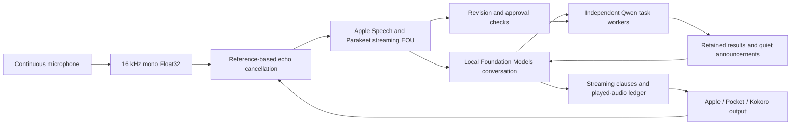

# Local voice conversation: diagnosis and next architecture

Installed: **build67**, `/Applications/Next Notes.app`, signed with the existing local signing identity; strict recursive signature verification passed. All audio and conversation processing remains on-device.

## Build67: reconcile streaming recognition before deciding who spoke

The shared echo classifier now exposes token positions. Apple and the local
decoder each have their own recognition state, which retains echo labels only at
unchanged leading positions of their cumulative snapshots. A changed prefix stops
inheritance; appended words are classified independently. Turn/session resets clear
both states, and a local decoder discontinuity clears the local state. Preparation,
visible partials, endpoint selection, and wordless endpoint eligibility all use the
same source-owned reconciliation, rather than recomputing away an earlier decision.

A trailing partial token can be withheld only when it is a two-or-more-character
prefix of the next rendered word after at least two contiguous exact word matches.
That temporary label is not retained: final endpoints re-evaluate the word as final.
An isolated `stop` is never withheld because it prefixes `stopping`. This addresses
a streaming token boundary; no screenshot phrase is special-cased in production.

Both stateless and stateful callers share one classifier and immutable-range text
reconstruction. Review caught and corrected an off-by-one partial boundary and an
unsafe string-index mutation before installation. Regression fixtures include
Unicode and multiple disjoint echo spans, preservation of user punctuation,
independent recognizer state, changed prefixes, reset, old `Mine?` plus a fresh
`question`/`questions` revision, and appended `please stop`. All nine deterministic
conversation/capture/duplex suites pass in this build. Physical results below are
reported separately from those controlled tests.

### Final physical results for build67

| Probe | Completed / interrupted clauses | Pause polls | False user turns | Result |
| --- | --- | --- | --- | --- |
| Default Pocket / queued Speex, run 1 | 4 / 0 | 0 | 0 | PASS |
| Same default path, independent repeat | 4 / 0 | 0 | 0 | PASS |

The two runs measured raw speaker-window RMS .00619 and .00588 against room
baselines .000183 and .000000109. Both observed rendered PCM and fed Apple ASR and
the ready local EOU decoder. These are real speaker-to-microphone replay results,
not silent-microphone or fake-playback passes. Detailed timestamped transcript
receipts are in `voice-investigation/2026-09-14-luna/nextnotes-voice-echo-default-67.txt`
and `nextnotes-voice-echo-default-67-repeat.txt`.

The final real file-fed interruption test also passes. It retained the full
`wait please stop speaking` request, paused audio **.846 s** after voice onset
(**.000070 s** after the accepted ASR partial), and permanently cancelled the old
reply at its confirmed endpoint after **2.547 s**. No queued old clause restarted.
That cancellation time is not time spent talking over the user: playback was
already paused. The .846-second pause delay still falls short of conversational
human responsiveness. The probe injects a recorded voice into the recognizer path;
a real person interrupting laptop speakers remains a separate acceptance test.

These results resolve the reproduced screenshot phrases in two controlled room
runs. They do not establish universal echo rejection across arbitrary sentences,
volumes, rooms, or speaker-identical repetition. AEC3 still has the independently
measured near-speech loss documented below, and none of the experimental DSP,
source-node, or small-capture-buffer configurations has been promoted. The normal
app keeps its existing Pocket/Speex acoustic path with the corrected recognition
and playback-lifetime handling. Saved conversation history was not rewritten.

## Build66: echo references follow acknowledged playback

The output reference clock previously began at enqueue/finalization, before TTS
synthesis or the audio queue had played anything. In the default build65 failure,
first audio arrived 2.07 seconds after enqueue. The one-edit echo guard aged out
three seconds after enqueue even while the reply was being spoken. It also used
future, unrendered reply text as an echo reference.

References now originate only from a backing's `startAcknowledged` clause event.
They remain active through reversible pauses and close on completion or a rendered
interruption, which starts their tail clock. Cancelling an unrendered queued clause
does not create a reference. Exact-match tails retain the existing 15-second window;
one-edit single-word tails retain three seconds after playback, with protection
throughout the active clause. This is clause-level acknowledgment, not a claim
that the app can measure individual words heard by the person.

Nine deterministic suites pass: voice turns, suspend, work lifecycle, delivery,
concurrent voice, conversation, scheduling, capture, and duplex. Tests explicitly
acknowledge the synthetic playback instead of treating queued text as audible.
New checks cover delayed first audio, future queued words, active long-clause
revisions, independent expiry of old clauses, and unrendered cancellation.

Two physical default-path runs remain failures. The first completed all 4 clauses
with no user turn but 23 pause polls (~2.3 s). The repeat completed 3/4, paused for
34 polls (~3.4 s), and accepted `that thing` from Apple's misrecognition of the
assistant's `anything`. This disproves a claim that playback-clock repair alone
solves self-echo. Real file-fed interruption still passes: voice-to-pause .849 s,
voice-to-final-stop 2.494 s, full `wait please stop speaking` retained.

Probe-only transcript events exposed two separate consumer defects: a trailing
partial word (`any` in `anything`, `quest` in `questions`) survives removal of its
matching multiword playback prefix and is treated as a novel partial; and an
Apple cumulative prefix (`Mine?`, previously removed as fresh echo of `mind`)
reappears in later snapshots after the same reference's fuzzy window expires.
Work on provisional token boundaries and per-recognizer classification retention
is separate from the underlying acoustic leak. No phrase-specific whitelist or
longer global echo window is warranted by these examples.

A separate test-only `--acoustic-active-reference-accounting` experiment passes
its digital bookkeeping check: 38,400 observed silent render samples contribute
zero adaptation samples, stopped output stays stopped despite subsequent zero
buffers, and sparse underflow contributes only 9,600 actual paired energetic
samples. Near-signal gain is 1.00 in those fixtures. This does **not** establish
real room echo cancellation and is not enabled for normal app use or AEC3.

## Build65: provisional speech and confirmed empty endpoints

The direct Speex live run in build62 produced no accepted user turn, yet it still
cancelled one spoken clause. That is a failure: an empty history does not prove
uninterrupted playback. Provisional novel ASR now holds the input barrier and
pauses the existing output token once per turn. A confirmed, accepted user turn
permanently stops the old output exactly once. Echo/wordless/acknowledgment
revisions resume the same token and queued clauses. Background work retains its
separate lifetime. No raw acoustic candidate is newly treated as speaker identity.

The pinned FluidAudio decoder emits a confirmed EOU callback even when its lexical
transcript is empty. The wrapper discarded that callback, and capture discarded it
again. An already-held false partial consequently waited for the generic 2.5-second
silence fallback. The wrapper now preserves this endpoint event. Capture uses it
only to settle an existing provisional hold when the local decoder is caught up,
no usable Apple/local words or local final exist, and no committed input is active.
It creates no text or idle speech activity. Eligibility is checked again at the
endpoint tick, so later valid transcript revisions remain protected.

Build64 passed nine deterministic suites: voice turns, suspend, work lifecycle,
delivery, concurrent voice, conversation, scheduling, capture, and duplex.
Build65 additionally passes the updated voice-turn regression, including immediate
wordless endpoint recovery, preservation of Apple speech during local backlog,
and ignoring wordless endpoints while idle. The model-backed EOU probe now requires
a nonempty final transcript from its speech fixture; merely forwarding an empty
callback cannot make that test pass. The actual model probe passes in build65
with the spoken interruption WAV.

The live echo probe now fails on any observed playback pause, as well as cancelled
clauses or accepted user turns. Resuming after a false pause is useful recovery,
but must not be presented as successful full duplex. Fresh hardware checks still fail the acoustic acceptance gate:

| Build65 configuration | Completed clauses | False pauses | Accepted false turns | Result |
| --- | --- | --- | --- | --- |
| Production Pocket / queued Speex | 3/4 | 40 polls (~4 s) | 1 (`asks.`) | FAIL |
| Persistent source / direct Speex / small capture buffers | 4/4 | 26 polls (~2.6 s) | 0 | FAIL |
| Persistent source / AEC3 no-reverb / normal capture | 4/4 | 0 | 0 | Echo-only PASS; prior near-speech gate still FAIL |

Both tests measured actual speaker bleed above quiet room baseline and fed both
recognizers. The alternative path now preserves the complete reply, but its false
pauses are still a user-visible failure. A real file-fed interruption passed:
voice onset to reversible pause **0.835 s**, accepted provisional ASR to pause
**0.000064 s**, voice onset to final cancellation **2.455 s**. The recognizer kept
`wait please stop speaking`; no queued old clause restarted. This is a file-fed
recognition/playback test, not proof of live human double-talk. Experimental source playback, AEC3 options, direct Speex, and the
small-buffer capture path remain self-test-only.

## 18:48 self-echo report: reproduced failures and corrections (through build67)

Build67 is installed in `/Applications/Next Notes.app`; `make install` and strict
recursive code-signature verification passed. The normal process uses Pocket with
Speex. All acoustic alternatives below remain self-test-only. This is a partial
correction, **not a claim that physical full duplex now works**.

The user's screenshot and saved conversation show generated assistant phrases
returning as voice input. The installed app was the expected build52, not an old
copy. Its logs show repeated false barge-ins. Those logs do not include acoustic
candidate receipts, so the exact callback responsible cannot be reconstructed.

A concrete trust-boundary defect was found: `AcousticEchoProcessor.nearCandidate`
is advisory residual energy/coherence, but capture latched it as human-speech proof
for the entire turn. That disabled every transcript echo check. The latch and its
boolean bypass have been removed, rather than retained as an unverified test-only
claim of speaker identity. Acoustic candidates still inform activity scheduling.
The production capture regression passes for an advisory candidate plus echoed
Apple/local text, a later local endpoint, and a genuine mixed-in `Stop`. Deliberate
repetition of the assistant's exact words remains limited until an independent
acoustic distinction is validated.

The earlier clean capability test missed contamination from saved failed answers.
An in-memory fixture now seeds the old conversation, without reading or rewriting
real user history. Build53 reproduced the exact bad answer to `What can you do`.
Quoting prior chat as classifier context still failed (build54); expanding capability
prompt wording fixed that fixture but misrouted four of fifteen other cases
(build55), so that version was rejected. The final classifier reads the current
request plus authoritative active-task status. It no longer consumes conversational
answers as routing demonstrations. Answer generation and workers retain bounded
conversation context. Build56 passes all 15 routing cases and the polluted-history
replay: four authoritative capability answers, a silent hesitation, and a substantive
ordinary answer afterward. Production logs now name the selected route without
logging private user text.

A new `--selftest-voice-echo-live` drives actual playback, microphone capture, AEC,
recognizers, and endpointing while replacing tool dispatch with a recording sink.
Initial hardware results exposed the remaining defect rather than passing it:

- Default Pocket/Speex: **FAILED**; four clauses enqueued, three began, one
  completed, three interrupted, and one false user turn (`you haven't`). Raw
  microphone RMS .00687 versus room .00000132 established audible bleed.
- Pocket source renderer with small capture buffers and Speex: **FAILED**; four
  clauses enqueued, two began, none completed, four interrupted, one false turn
  (`Bye.`). Its higher room baseline is a limitation of that run.
- Pocket source renderer with AEC3: **FAILED to render**, zero first-sample or
  completion receipts, zero nonzero reference energy. Capture configuration changed
  while the source graph was alive, followed by source-playback failures. Zero user
  turns in this run are **not echo-cancellation success**.

The new source backing streams actual Pocket frames (24 kHz) into the 16 kHz source
renderer and retains generation-scoped first/drain receipts. It is wired behind
`--voice-pocket-source`, not promoted. Its graph reconfiguration lifecycle and the
physical echo/near-speech tradeoff still require correction and validation. The
full-pipeline probe is being tightened with playback-windowed raw energy and
recognizer execution receipts so silent/non-running components cannot pass.

### Follow-up validation after build56

The full microphone/recognizer/endpoint probe with existing Pocket playback and
AEC3 (without the source renderer or sink capture) completed all four clauses and
emitted **zero user turns**. Raw microphone RMS was .00970 and the render reference
was nonzero. This is an echo-only success, not a double-talk pass. The corresponding
Pocket hybrid probe failed to drain its first calibration utterance after 25 s;
that failure provides no evidence about preservation of the near speaker.

Build59's graph lifecycle test passed: token 1 acknowledged playback, received
exactly one configuration-loss failure and no completion; the rebuilt graph
started and drained token 2. A queued old-generation notification did not affect
that token. Source playback now fails the current clause explicitly and tears down
its producer, rather than waiting indefinitely or silently changing voices. The
capture integration prepares input before the persistent output graph. Voice-turn
regression also passed. These source-node changes remain experimental.

The full echo probe now meters raw energy only during acknowledged playback and
requires actual ASR feed plus EOU processing/readiness receipts. A dead recognizer,
unrendered reply or merely noisy room cannot satisfy those gates. Silence in ASR
is allowed when cancellation succeeds; this is not a positive near-speech control.

A direct native AEC3 replay reproduced early near-speech suppression without any
microphone or output graph. It uses 16 kHz float WAVs, a synthetic two-tap echo path,
quiet/strong known overlapping speech and near-only calibration. Calibration
measured 128 samples of native delay (the Swift wrapper adds another 160); fitting
the wrong delay was rejected before recording the following results. With default
settings, first-100-ms near gain at 0.1 s was .004/.009 and full-clip gain .005/.041.
At 4 s, first-100-ms gain improved to .450/.694 and full-clip gain .788/.881.
Echo-only attenuation was 27.0 dB. Thus adaptation helps, but cold interruption
still fails. Setting only the upstream initial filter duration to zero did not
repair it. Linear-export allocation alone did not materially change final output.
These are controlled synthetic-path results, not a physical room acceptance test.

### Build61: source playback recovered; acoustic promotion rejected

`make build`, `make install` and strict recursive signature verification passed.
The extended graph test also verifies that a configuration change **after** a
clause drains does not retrospectively report that completed clause as failed.
The fixed-WAV probe now subscribes capture before starting output, observes
renderer failures through drain, and reports them immediately with a bounded
reason. Legacy Pocket's earlier non-drain remains unexplained by that fix: no
same-run graph-change evidence was saved for that legacy run.

With the normal application closed, the full live echo probe ran twice using real
Pocket synthesis, the source renderer, AEC3 and the diagnostic nonlinear-reverb
switch. Both runs passed: 4 clauses enqueued/started/completed, 0 interrupted,
0 user turns, ASR fed more than 244k samples, EOU processed and ready. Microphone
RMS during acknowledged playback was .01339/.01473 against quiet room baselines.
This demonstrates live echo rejection through the recognizers, with real output.
It does not establish overlapping human speech or all voices/routes.

The hybrid source probe with that same AEC3 setting and normal microphone
buffering completed all four playback passes, with no renderer or AEC failure,
but **failed near-speech preservation**. Near-only calibration retained the
known waveform at essentially unit gain. Mixed early quiet/strong gains were
.18/.17; later quiet/strong gains were .08/.14. The first 100 ms were nearly
absent. Capture-to-processing averaged 63–71 ms with approximately 100 ms input
batches. Thus successful echo-only recognition is insufficient for promotion.

The native replay isolates settings without audio devices or graph failures:

| AEC3 diagnostic setting | Echo attenuation | Early first-100-ms near gain (quiet/strong) | Later full near gain at 1.5 s (quiet/strong) |
| --- | --- | --- | --- |
| Default | 26.99 dB | .004/.009 | .282/.261 |
| Nonlinear reverb disabled | 26.93 dB | .627/.635 | .290/.283 |
| Sensitive near detection | 27.08 dB | .005/.008 | .394/.353 |
| Both preceding options | 26.93 dB | .627/.635 | .394/.353 |
| Bounded spectrum for near detector | 27.08 dB | .005/.008 | .290/.283 |

The smaller-buffer hybrid repeat also failed: capture-to-processing fell to
about 18 ms, all playback passes drained, but early quiet/strong gain was .27/.24
and later quiet/strong gain .19/.40. Opening-syllable retention still failed.
Smaller buffers alone do not solve the suppression defect.

These setting changes remain evaluation-only. They locate a source of initial
suppression; none meets all near-preservation requirements. A direct ABI test
also rejected unknown option bits and verified unit-scale linear output with
all supported options enabled.

Read-only production review found two further causal risks needing integrated
repair, not a phrase blacklist: Pocket starts its mixer before PCM synthesis
finishes, and silent render buffers count toward Speex's claimed adaptation.
Mic samples also advance that count on reference underflow. In addition, the
production Speex FIFO pairs independently delivered render/mic samples by arrival
order rather than their host timestamps. Its existing first-reply fixture starts
with nonzero far speech and misses the measured 2.031 s silent Pocket pre-roll.
Simply changing the adaptation count could increase cold raw-audio leakage;
that change has not been promoted without an echo-and-near regression.

### Build62: direct Speex timing and provisional interruptions

The vendored Speex header documents that `speex_echo_playback/capture` adds a
fixed two-frame soundcard delay; `speex_echo_cancellation` operates on supplied
paired frames without that delay. A self-test-only switch compares the direct
API using the identical capture/reference queues, postfilter and trust policy.
The direct path passed existing digital tests: speech ERLE 20.7 dB, near
correlation .87/gain .73; first-100-ms near correlation/gain .89/.89; cold far-only
ERLE 10.2 dB with no false near candidates. Those fixtures do not prove the
arrival-order queues align on real hardware.

Source-renderer + direct Speex + small capture buffers passed a physical hybrid
run after 2 s of actual silent rendering before each utterance. Relative near
gains were .88/.86/.93/.98, first-100-ms gains .64/.85/.87/.95, and near candidates
arrived 145–228 ms after injected onset. All four playback passes drained.
The room baseline (.00329 RMS) limits comparison with quieter runs. The same
configuration with normal capture buffering failed: some quiet calibration
correlations were below the gate, and some mixed near candidates were absent or
late. This is not evidence that normal capture is ready for promotion.

Full live source + direct Speex runs at both input cadences emitted zero false
committed user turns, but each **failed** because one provisional ASR fragment
permanently interrupted playback. In the normal-capture trace, the input was
later discarded as speech activity without usable words. This exposes an
independent ownership error: an ASR hypothesis destroys a reply before input
is settled, leaving nothing for the discard path to resume.

The echo-only acceptance probe now also counts sampled listening pauses (100 ms
polling) and requires zero observed pauses. A reversible false pause is better
than losing the reply but remains a failure of uninterrupted echo-only playback;
changing pause policy must not manufacture a green acoustic verdict.

## Luna review and implementation wave — verified results and remaining gaps

**Previous deployment (before the 18:48 feedback report):** `make install` replaced `/Applications/Next Notes.app` with
investigation build52 and relaunched it. Strict recursive signature verification
passed under `Next Notes Local Signing`. Build52 uses the separated typed router
and streaming answer stage by default. The legacy envelope and joint typed paths
are retained only for explicit self-test comparison (`--voice-legacy-envelope`).

The 15-case real-model routing suite passed before promotion (build44), covering
ordinary questions, overview questions, specific feature/permission questions, new
actions, status of existing work, corrections, and cancellation. Build45's default
five-turn conversation replay also passed: four grounded capability replies, one
silent hesitation, no tool dispatch. Ten targeted deterministic checks passed:
capabilities/failures, voice turns, voice scheduling, concurrent voice, conversation,
suspend, streamed speech, capture, callback isolation, and speculation.

The signed file-fed pipeline passed with the complete recognized haiku request and
a substantive answer. It reported zero EOU drops/resets; EOU startup took 2.516 s,
speech end to endpoint 1.168 s, and endpoint to first audio 1.656 s. Thus the
observed speech-end-to-audio delay was about **2.82 s**. This is still a material
latency gap; the test does not establish conversational fluency. Its trace exposes
older Apple partials replacing newer local-decoder partials during preparation.
The source-ownership correction below addresses that behavior; it has not yet
established a latency improvement.

The signed experimental PCM-source/AEC3 probe completed without the prior callback
crash. It measured 50.1 dB conservative echo attenuation, no reverse-reference
overflow, and valid first/drained receipts. Render reference frames were 160 samples
at 16 kHz (10 ms), while microphone batches remained about 100 ms. This is one
echo-only room observation, not proof of human double-talk. Production audio still
uses its existing backing; experimental acoustic paths remain gated.

Build47 gives each utterance a single partial-text owner: Apple supplies startup
and failure fallback; the local decoder takes ownership after the audio backlog
reaches the existing live watermark and it emits a nonempty partial. Apple keeps
its cumulative cursor but cannot overwrite local preparation. Shorter local
corrections and explicit endpoints remain authoritative. Decoder discontinuity or
failure restores Apple; a new turn clears ownership. The cursor merge no longer
concatenates two alternative transcriptions. The deterministic ownership and
cursor regressions passed, together with capture, capabilities, and scheduling.
The WAV feeder now uses absolute recorded-time deadlines, avoiding cumulative
sleep overhead at 10 ms. These are implementation checks; latency is measured
separately below.

The signed source-node plus sink-node AEC3 hybrid probe **failed** in build47.
All near-only calibration cases had correlation/gain 1.00, but with physical far
playback the early quiet/strong near gains fell to 0.00/0.02, and warmed gains to
0.41/0.37. The first 100 ms were heavily suppressed. Render frames were 10 ms and
capture-to-processing averaged 18.6 ms; reducing batching did not resolve near
speech loss. This test renders a real far waveform and injects a known near WAV
into microphone input; it does not establish human double-talk. The experimental
path remains gated. “Warm” in these fixture labels means 1.5 s after each fresh
AEC reset, still within the bundled default 2.5 s initial-state period. It does
not establish fully adapted performance. The silent first two passes are
near-only calibration; only the latter two passes contain nonzero far playback. Its probe backing now distinguishes actual task cancellation
from a renderer-generated cancellation error so internal renderer failure is
reported rather than silently waiting for the watchdog.

The build47 full pipeline passed at both input cadences with no EOU resets or
drops, but performance varied: 80 ms feed measured 1.130 s to endpoint plus 2.446 s
to audio (**3.58 s total**); absolute-paced 10 ms feed measured 1.113 s plus 1.714 s
(**2.83 s total**), with maximum pacing slip 23 ms. File-fed barge-in stopped output
0.848 s after input onset and 1.4 ms after accepted novel ASR, with no old clause
restart. The rapid-turn probe committed two requests through local EOU, started
the second input 6.6 ms after the first commit, and recorded zero decoder resets or
drops. The second transcript was “please stop speaking,” omitting the fixture's
initial “wait”; the test verifies preserved stop intent, not word-perfect ASR.

A startup-order experiment is gated behind `--voice-eou-first` in self-tests.
Build48's first version did not isolate startup: acoustic staging and partial
speculation still started the frontend early. Build49 gates those entry points as
well. EOU preparation then measured 1.465 s, but total response delay increased to
**4.17 s** (1.109 s endpoint + 3.058 s audio). The full local partial arrived at
3.040 s and a matching speculation had 0.868 s head start; remaining inference
latency still dominated. The reordered startup is **not promoted**. Build49 with default startup subsequently passed at 2.84 s total
(1.016 s endpoint + 1.825 s audio), again showing that startup ordering alone is
not an established improvement. Additional
phase instrumentation is being added to separate warmup, obsolete inference drain,
scheduler wait, routing, and answer generation rather than infer them from totals.

Build49 also removes the pre-ownership word-count heuristic: backlog text cannot
claim a live interruption merely by containing more words. The single owner
handles both preparation and novel-speech interruption. The local partial adapter
now forwards empty revisions so cancellation of obsolete preparation is reachable
from the producer. Turn-policy regressions passed after these changes.

Evidence: `/tmp/nextnotes-luna-install49.log`,
`/tmp/nextnotes-luna-pipeline-eoufirst49.txt`,
`/tmp/nextnotes-luna-pipeline47.txt`, `/tmp/nextnotes-luna-pipeline10ms47.txt`,
`/tmp/nextnotes-luna-barge47.txt`, `/tmp/nextnotes-luna-rapid47.txt`,
`/tmp/nextnotes-luna-hybrid-source47.txt`, the build47/49 regression logs,
`/tmp/nextnotes-luna-install45.log`,
`/tmp/nextnotes-luna-splitrouting44.log`, `/tmp/nextnotes-luna-live45.log`,
`/tmp/nextnotes-luna-pipeline45.txt`, `/tmp/nextnotes-luna-pcm-source45.txt`,
and the named `/tmp/nextnotes-luna-*45.log` regression outputs.

### Final measurements from this wave

Build52 passed the full on-device WAV-to-reply pipeline and targeted turn,
capability/failure, speculation, capture, and concurrent-voice regressions.
`make install`, strict recursive code-signature verification, and
`git diff --check` passed. Build numbers here label investigation iterations,
not a separately advertised application release version.

The instrumented default pipeline measured **3.53 s** from speech end to first
audio (1.214 s endpoint + 2.320 s audio). Native warmup and scheduler waits were
below the diagnostic's 1 ms resolution; cancelled native producers drained in
0–1 ms. The accepted generation took **0.863 s for typed routing** and reached
first answer text at **1.713 s** from generation start, about another 0.849 s.
Its matching preparation had only 21 ms head start. Speech buffering/rendering
added 0.618 s after first text. In this run, model work and delivery dominate;
the evidence does not support blaming a stuck queue. The observed default
pipeline range across these single-fixture runs is roughly **2.83–3.58 s**,
not a distribution or a human conversational rating.

The same-build acoustic comparison isolates the remaining tradeoff:

| Output measured | Near-speech result | Echo-only result | Decision |
|---|---|---|---|
| AEC3 final output | Failed: early quiet/strong gains 0.00/0.04; later 0.36/0.36; early first 100 ms effectively lost | Earlier final-output source probes strongly attenuated echo | Keep experimental; fails near preservation |
| AEC3 linear output before residual suppression | Passed all four hybrid cases: gains 0.95/0.79/0.90/0.77; first-100-ms relative gains 1.16/0.55/0.72/0.60; candidates at 113–121 ms | Failed: only **7.2 dB** conservative attenuation, raw RMS 0.00808 → cleaned 0.00351 | Keep experimental; fails residual echo gate |

Both hybrid runs had zero processing failures and nonzero far playback in their
two mixed passes. Linear calibration used a fixed 224-sample delay; final output
used 288 samples, each established by its own near-only calibration. The runs
were sequential in the same room, not simultaneous recordings of identical room
noise. These results strongly implicate nonlinear residual suppression in lost
near speech. They **do not** justify replacing final output with linear output
wholesale: that leaves substantially more echo. The remaining design needs a
near-speech detection path and preservation of speech onset while controlling
residual echo, then validation with the actual TTS producer and a human.

The experimental source-node backing still renders a fixed test waveform.
Production Pocket speech still uses its existing player-node backing, and the
source/sink/AEC3 modes remain opt-in. Thus the hybrid pass is a diagnostic
breakthrough, not a claim that production voice is now fully duplex.

The linear diagnostic also exposed an integration fault before installation:
APM's export flag allocated an output buffer, but its default AEC3 instance had
not enabled its internal linear framer, causing an isolated Python ABI probe to
crash on the first capture frame. The diagnostic constructor now sets both flags
through an explicit factory, and the bridge compiles with the same release and
platform definitions as the pinned native library. The corrected ABI probe
processed 80 real frames and measured expected mean-square energy
0.005003 (target ≈0.005). Swift always processes capture before fetching the
export; missing symbols, invalid explicit delay, and per-frame failures cannot
silently count as a successful hybrid run.

Primary evidence is preserved under
[`Tests/Reports/voice-investigation/2026-09-14-luna`](voice-investigation/2026-09-14-luna),
including the routing replay, baseline and instrumented pipelines, source A/B,
echo-only linear failure, ABI check, regression results, and install output.
Unmet acceptance: human speaker/microphone double-talk, stable subsecond response
latency, and a production audio path that passes both echo and near-preservation
gates. No human-level fluency or permanent elimination of bugs is claimed.

The user requested Luna at high reasoning for this wave. Three bounded agents
reviewed capability grounding, failure handling, and acceptance tests. The root
agent owns builds, integration, and model-backed verification. Older Sol agents
remain stopped. All audio and conversation inference remain on-device.

The following findings are established by source inspection and local probes:

- The frontend lacked the actual execution registry. A shared snapshot now reads
  the planner's 42 allowed tools plus cached Workspace state and current
  Accessibility state. Unprobed Workspace state is unknown, not disconnected.
- Model errors, malformed output, empty output, incomplete output, cancellation,
  and deadline expiry previously collapsed into a clarification request. They now
  retain distinct bounded diagnostic codes. An internal error no longer claims
  the person's recognized words were unintelligible.
- A response producer that lost its deadline race could still call the speech
  tracker after cancellation. The tracker now closes permanently until an explicit
  new response begins. A delayed-producer regression verifies no late speech is
  enqueued after timeout.
- The callback-isolation regression itself previously used a synchronous queue
  operation that could execute inline. It now dispatches asynchronously, verifies
  an off-main thread, and drains real reference frames. The dedicated callback
  self-test passed; that does not establish physical acoustic performance.
- The controller prompt could itself induce tool dispatch for capability
  questions. With the same inventory/question and native history, the build35
  causal probe emitted `<use_tools/>` for the full controller prompt, but a
  concise prompt answered correctly. Native conversation roles alone did not fix
  this behavior.
- Delivery diagnostics were being embedded as assistant conversation text. The
  model repeated “No complete spoken clause was acknowledged” in build36's native
  replay. The frontend now receives actual message text separately from playback
  status; build37's native replay no longer emitted that diagnostic.
- A standalone “Uh” initially attempted to dispatch work. It is now a silent
  hesitation in the coordinator. A separate producer review found that the ASR
  partial could already stop TTS before reaching that handler; fixing and testing
  both partial and endpoint cancellation edges is part of this wave.

### Acceptance failures caught during this wave

An early live test printed success despite the tool guard reporting an attempted
dispatch. The harness overwrote `SelfTest.failed`, and a finished worker disappeared
from the active-job check. Both are corrected: attempted dispatches are counted,
and prior harness failure is preserved. That early result is invalid evidence.

Build36's default replay appeared better but omitted the shell category and ended
one answer mid-word. The stricter acceptance now requires all capability categories
for a complete overview and checks for complete sentences, false denials, and leaked
delivery diagnostics. Build37 and build38 failed these stronger checks. Native
history reduced some failure modes but did not reliably enumerate features needing
connection. Longer prompt instructions also led to verbose, truncated tool lists.

Consequently, repeated wording changes are not an accepted solution. A typed
on-device response contract is being evaluated: the model chooses conversational
intent, while application introspection is rendered from the authoritative registry
and availability state. This is a semantic route, not a keyword match for the
screenshot's exact questions. Ordinary answers and background-work controls still
need independent regression coverage before this path can become the default.

Evidence: `/tmp/nextnotes-luna-capabilities37.log`,
`/tmp/nextnotes-luna-pcm-callback32.log`,
`/tmp/nextnotes-luna-prompt-native35.log`,
`/tmp/nextnotes-luna-live37.log`, `/tmp/nextnotes-luna-native37.log`,
`/tmp/nextnotes-luna-live38.log`, and `/tmp/nextnotes-luna-native38.log`.
These model replays use text, not a microphone or physical speakers. They cannot
establish human end-to-end latency, echo rejection, or full-duplex readiness.

The latest installed application is still the earlier build31 at this point.
New source is not a claim that these fixes have been deployed or accepted.

### Subsequent gates in this wave

The joint typed decision (intent plus generated speech in one object) passed the
five-turn capability replay in build39, but failed ordinary work routing in
build41: opening Chrome or Safari was classified as a capability overview. A
typed schema guarantees representation, not semantic correctness. This variant
was not promoted to the default.

The next variant separates a small, completely collected typed route from answer
generation. Routing receives conversation and work status; it does not receive
the large tool inventory. An overview route renders the application's registry
directly. Ordinary questions enter a separate streaming answer stage. New work,
corrections, and cancellation remain controls owned by the coordinator. The answer
stage has no effect API. It cannot turn its spoken text into tool execution.

Build42 correctly routed external actions that the joint variant missed, but
incorrectly treated a status question about a running calendar task as a new task.
The complete routing suite therefore failed; it was not treated as an acceptable
partial success. Build43's exact conversation replay passed with no work dispatch:
the four capability replies took 0.804, 0.764, 0.867 and 2.885 seconds from committed
text to completed text. These are individual model measurements, excluding ASR,
EOU and TTS. The hesitation took no model turn. General routing remains a separate
acceptance gate.

Producer fixes now have deterministic evidence: build40's voice-turn suite passes
the overlapping hesitation and subsequent meaningful interruption cases. Build42's
capability suite also verifies that a response already being generated survives
“Uh”, while its later completion cannot release the newer unfinished-input barrier.
It still verifies that an expired producer cannot restart speech after timeout.

A separate startup defect was found: `beginConversationSession` eagerly loaded and
prefilled Qwen even though the new conversational frontend does not use Qwen. It
now acquires a residency lease only; the first actual worker request owns the cold
load. Existing explicit prewarm benchmarks remain explicit. The scheduling suite
passes a cold-lease check that starts no model operation and releases its lease.
Removing unnecessary startup compute is established; improvement to physical EOU
latency still needs measurement.

Evidence: `/tmp/nextnotes-luna-typed39.log`,
`/tmp/nextnotes-luna-routing41.log`, `/tmp/nextnotes-luna-splitrouting42.log`,
`/tmp/nextnotes-luna-splitlive43.log`, `/tmp/nextnotes-luna-turns40.log`,
`/tmp/nextnotes-luna-voice-capabilities42.log`, and
`/tmp/nextnotes-luna-voice-scheduling42.log`.

## Earlier installation and investigation: 16:52–16:53 EDT

At the user's subsequent request, `make install` successfully built the pending
source, replaced `/Applications/Next Notes.app`, and relaunched it. This build is
tracked as **build31** in the investigation logs, not as an application version.
Strict recursive code-signature verification passed with the stable local signing
identity. The installed binary passed `--selftest-capture` and
`--selftest-voice-speculation`. Evidence: `/tmp/nextnotes-duplex-install31.log`,
`/tmp/nextnotes-capture31.log`, and `/tmp/nextnotes-speculation31.log`.
The experimental callback crash fix is now compiled and installed; its off-main
regression/hardware probe has not been run on this build. Experimental source/sink
audio paths remain outside the normal configuration. Subagent implementation work
remains paused.

The user then supplied a screenshot of a real conversation at **16:52–16:53 EDT**.
The saved conversation and audit log confirm eight user entries and seven assistant
replies. Six of those replies are marked interrupted. This exchange is a functional
failure despite faster response generation: clear capability questions produced an
incorrect denial followed by repeated fallback replies.

### Evidence and root-cause assessment

| Observation | Evidence and interpretation |
| --- | --- |
| “What can you do” received a generic invitation to ask a question | The new frontend did not describe the application's actual capabilities. |
| “can you list me all of your tasks, all of your capabilities and functionalities?” received “I don’t have tasks or capabilities to list…” | `VoiceConversationCoordinator.frontendRequest` supplies job status, using “No tasks.” when empty, but supplies no actual tool inventory or connection state. The system prompt mentions local tools generically. Conflating empty work status with absent capabilities is a plausible model error; the missing inventory is confirmed in code. |
| “What about your tools?” and “What are the list of tools that you have?” received identical clarification requests | Both questions are correctly present in the transcript. `VoiceConversationCoordinator.respond` emits the hardcoded “I couldn't interpret that. Could you say it another way?” for unresolved output. Stream errors are caught as `.invalid`; invalid envelopes, pending output at completion, and the response deadline also reach this fallback. Its wording does not establish an ASR failure. The raw output/error for each failed turn was not retained, so the precise trigger remains unknown. |
| Existing capability handling did not help | `RealtimeAgent.capabilitiesReply(for:)` exists on the older routing path. The new coordinator independently builds the voice response and does not call that path or provide an equivalent authoritative capability snapshot. This is an integration gap introduced by the new architecture. |
| User entries include “No, uh... Could you say it”, “I couldn't quite under”, and “Access to. I” | Fragments and interrupted replies show an unsuccessful exchange. The similarity to preceding assistant speech suggests possible acoustic feedback, but deliberate repetition by the user cannot be ruled out without retained audio. Do not label echo as proven from text alone. |
| Six of seven replies are marked interrupted | These are playback-ledger observations, not proof that all six were unwanted interruptions or that none of their audio was heard. Several have no completed clause recorded. |
| No tool events occurred in this latest exchange | The audit contains conversational requests/replies only for this interval. The “Recent tasks (8)” screenshot row is not evidence that eight tasks were executed during this conversation. |

The new frontend also flattens role-labelled history into one text prompt and retains
only a bounded history. This deserves evaluation for conversational recovery, but
the available evidence does not establish it as the cause of these particular failures.

### Timings from this real session

| Span | Measurement | Scope |
| --- | --- | --- |
| Opening committed transcript → first model text | 0.549 s | Excludes listening and end-of-turn detection. |
| Opening first model text → first audio callback | 1.049 s | Together approximately 1.60 s after transcript commit; not physical microphone-to-speaker latency. |
| Capability-list request → first model text | 0.0019 s | Consistent with already prepared output, but no retained speculation-hit trace proves reuse. |
| Capability-list first text → first audio callback | 1.467 s | Fast text did not eliminate the speech-start delay. |
| Local EOU startup catch-up lag | 5.08 s | Unified-log warning at 16:52:30.620; indicates startup backlog, not a measured 5.08 s delay on every turn. |
| Background Qwen load | 18.273 s | 16:52:27–16:52:46; background compute, not direct frontend response latency. |
| Background Qwen prefill | 22.194 s | 16:52:46–16:53:08 for 258 prompt tokens. Contention is worth investigating, but these spans alone do not establish its effect on the voice path. |

Sources are the local `agent-conversation.json`, `agent-audit.jsonl`, and
`metrics.jsonl` under `~/Library/Application Support/Next Notes/`, filtered to
2026-09-14T20:52:20Z–20:53:30Z. The available unified-log excerpt is
`/tmp/nextnotes-conversation-1652.log`. The screenshot corroborates the text but
does not supply acoustic timing. These are individual observations, not percentiles.

### Required corrections and acceptance coverage

1. Give conversation and execution a shared capability snapshot derived from the
   actual tool registry and connection/permission state. Distinguish supported,
   connected, available, and approval-required actions from current task status.
2. Preserve distinct error causes for response parsing, model generation, timeout,
   cancellation, and input uncertainty. Record bounded diagnostic context sufficient
   to diagnose the failure. Do not tell the user to rephrase a correctly recognized
   question because an internal response contract failed.
3. Preserve the unresolved capability question through hesitations and follow-ups.
   Evaluate speech fragments and playback feedback against timestamped input/output
   evidence before changing endpoint or interruption thresholds.
4. Replay this exact exchange through the real on-device model and conversational
   coordinator. Require a grounded capability answer, coherent tool follow-ups, and
   no tool execution merely to describe capabilities. Include model-error and
   malformed-output recovery cases.
5. Verify actual speaker/microphone overlap separately: preserve early near speech,
   reject assistant playback as a new user request, and handle hesitation and intended
   interruption without losing the question or background objective.

The existing passing buffer, cancellation, scheduling, and speculation tests did
not establish this basic product behavior. That acceptance gap must be closed before
claiming conversational readiness. No implementation changes were made during this
latest analysis; these corrections remain pending.

## Historical pause checkpoint, before build31

All three active Sol subagents were interrupted. No build or self-test was running
at the pause; the normal installed Next Notes process remained open. Changes are
in the working tree, not committed. The installed app is the build tracked in our
test logs as build30; build31 has not been compiled or installed.

The user-supplied crash report is from the experimental `--selftest-pcm-source`
probe launched by this investigation. Its reverse-audio DispatchSource callback
was created inside a MainActor-isolated method and trapped on the background
queue with `_dispatch_assert_queue_fail`. The source now creates that callback
through a nonisolated factory and includes an off-main regression probe. This fix
is **unbuilt and unverified in the app**. The experimental source renderer has not
been connected to the production Apple/Pocket playback backings.

Build30's capture regression also failed: the new opt-in sink ring constructed an
AudioBufferList view before setting frameLength, leaving zero writable byte size.
The source fix sets frameLength first; its standalone regression passes. The full
app capture regression still needs rerunning after a build. The authoritative
build30 log is `/tmp/nextnotes-capture30.log` and ends `CAPTURE_FAILED`.

Build30's canonical speculative-response regression passed. Full-pipeline reuse
and latency improvement remain unproven. The source/sink audio paths and AEC3 are
evaluation-only; production still uses the existing capture path and Speex. The
automatic acoustic pause trigger is not enabled because cold overlapping near
speech still fails the preservation gate.

Resume in this order: freeze all writers; build/install the pending fixes; run
the off-main callback and capture regressions before any hardware probe; then
evaluate source playback, sink capture, and 10 ms file-fed cold startup serially.
Only proceed to playback integration after echo and early near-speech gates pass.
Human-level full duplex has not been demonstrated.

The original conversation analyzed below was September 14, 2026, **12:51:45–12:54:57 EDT**. The requested product is a continuous, fully on-device conversation: the assistant can listen, yield speech, retain an objective, accept a correction, continue working, and deliver the result when there is room to speak. Keeping the microphone open is only one requirement.

## Evidence from the original session

Sources: `~/Library/Application Support/Next Notes/agent-conversation.json`, `agent-audit.jsonl`, and `metrics.jsonl`. The available unified-log excerpt was saved to `/tmp/nextnotes-latest-voice-unified.log`. Most info-level records had already expired; the audit and metrics are the durable evidence. There is no retained microphone/playback recording here with which to reconstruct acoustic overlap.

| Observed interaction | Recorded evidence | Cause or limit |
| --- | --- | --- |
| “How’s it going?” | 20.275 s transcript-to-first-token; another 1.506 s to the first-audio callback | About 21.8 s **after transcription**. This is not a microphone-to-speaker measurement. Cold local inference is a major contributor, independently reproduced below. |
| “What were you thinking about?” | 10.158 s transcript-to-first-token; the unified log reports an invalid decision containing `<answer/>` followed by answer prose | The router compared the entire completion to the exact decision marker. Useful answer prose caused an unnecessary tool-planning pass. |
| Open Chrome **and** check Claude sessions | Only `computer.open_app` ran, and the final reply was “Opened Google Chrome.” | The planner returned immediately after the first successful non-read tool. Completing one step was mistaken for completing the objective. |
| “No, Claude code C L A U D E…” | The old turn was superseded; a new ACP task contained only the correction | Any occurrence of “Claude Code” selected delegation. The conversational correction lost its original inspection request. |
| “Check Claude instead of cloud code” | Another attempt to open “Claude Code,” with the same failure | The final model repeated the obsolete target. Preserving correction context is necessary; accurate interpretation still depends on the model. |
| “Gotit … Whatwouldyou…” | The malformed text is present in the saved assistant reply | `ACPSession` trimmed whitespace from each message delta before concatenating it. |
| Apparent fast interruption | Two recorded stop spans were about 7 ms | Those spans start **inside the output-stop operation**, after recognition. They exclude detecting the person, ASR latency, and physical speaker drain. They cannot establish sub-100 ms perceived interruption. |

## What the reference actually supplies

`qwen-audio-agent-main` under `roadmap/references` is reference source, not a linked speech library in this Swift app. `Package.swift` links FluidAudio; the current voice capture explicitly constructs `AppleSpeechEngine`. Pocket TTS also uses FluidAudio. The local Qwen3.5-4B model is a text model behind llama.cpp, not the Qwen Audio realtime service.

Relevant reference components:

- `server/src/voice/realtime-input-runtime.mjs`: speech start clears playback and cancels the **frontend response**. Task execution has a different owner.
- `server/src/task/task-state.mjs`: task lifecycle and completion-notification policy are separate concepts.
- `server/src/voice/announcement/announcement-window.mjs`: user speech, a pending response, queued audio, and actual playback independently block announcements.
- `server/src/voice/sleep-controller.mjs`: the idle timer asks whether sleeping is currently allowed rather than interrupting work unconditionally.
- `docs/voice-frontends/qwen-audio-realtime.md`: the default uses DashScope speech-to-speech and semantic `smart_turn`. Copying the surrounding state names does not supply that model’s turn detection.
- `docs/voice-frontends/speech-to-speech.md`: a fully local, modular service with an Apple Silicon path is supported. Its latency and echo handling must be evaluated on this Mac.
- `docs/voice-frontends/minicpm-o.md`: the full duplex MiniCPM adapter does not currently expose backend tools, proactive announcements, restored transcript history, or input transcription through its public protocol. It cannot replace our entire agent interaction unchanged.

The official [OpenAI GPT-Live guide](https://developers.openai.com/api/docs/guides/live) also separates live conversation from a backend and explicitly states that interrupting speech does not automatically cancel backend work. Its [delegation guide](https://developers.openai.com/api/docs/guides/live-delegation) distinguishes quiet context from information to speak. These are architectural references, not an assertion about private ChatGPT internals or a proposal to send this user’s audio to the cloud.

Upstream [Hugging Face speech-to-speech](https://github.com/huggingface/speech-to-speech) documents a fully local Apple Silicon configuration, but also documents speaker-feedback limitations and a microphone-blocking workaround that prevents interruption. A local endpoint alone does not prove full duplex. The official [MiniCPM demo](https://github.com/OpenBMB/MiniCPM-o-Demo) is a separate model/deployment evaluation, not an established native Mac replacement.

## Implementation and ownership

The live conversation path now uses Apple Foundation Models on-device, independently
of the local Qwen tool planner. The earlier Sol wave covered acoustic playback,
streaming input/turn handling, and local frontend readiness. Those agents are now
stopped. The current wave uses Luna at high reasoning, with bounded tasks reviewed
by the coordinating agent, who owns integration and acceptance testing.

Changes address the producers of the observed behavior:

- A foreground response and each background objective have separate cancellation owners.
  Side questions preserve work; explicit corrections revise an identified task. Planning
  checks the revision again after approval and target resolution before effects execute.
  Completed results survive interruption. Several independent jobs can coexist.
- Input has its own revision. Sustained acoustic activity pauses new effects; recognized
  novel words can yield playback. Finishing an older answer cannot release a newer input's
  effect barrier. Nonlexical acknowledgments can be absorbed without cancelling work.
- Approval requests queue in order. One worker awaiting approval no longer causes a second
  worker to be silently refused. Cancellation dismisses only the matching task's request.
  Background completion does not replace the visible approval card.
- Qwen model/context ownership is reserved before compute scheduling. Planning yields
  between tokens and 128-token prompt batches. An interactive response uses an independent
  Foundation Models session, so it need not acquire Qwen's native context.
- The native conversation session is staged during speech. Its prompt-specific prewarm
  moves some activation work into listening time. It is a hint, not a readiness guarantee:
  [Apple documents at least one second of lead time and possible deferral under load or
  while backgrounded](https://developer.apple.com/documentation/foundationmodels/languagemodelsession/prewarm%28promptprefix%3A%29).
- Parakeet's actual streaming partial callback supplies early words when Apple has not
  emitted a transcript. Previously those partials were ignored. A fragment arriving before
  the minimum speech duration is reconsidered by the input timer, without waiting for
  another recognizer callback. EOU processing/reset/close operations remain serialized
  across Core ML suspension points; lag and discontinuities are detected explicitly.
- Capture uses canonical Float32 before AEC, levels and EOU, converting to Apple's preferred
  Int16 only at the recognizer boundary. The SDK preferred 16 kHz Int16 on this Mac; the
  previous same-rate shortcut bypassed DSP and reported zero Float32 level. This explains
  why isolated Float32 audio tests passed while live capture failed.
- Every supported voice feeds actual rendered mixer PCM into the vendored SpeexDSP echo
  processor. Epoch barriers reject stale render callbacks. Stopping playback retains the
  room filter for the echo tail. Natural drain stops the mixer rather than feeding endless
  zero buffers. Playback and interruption history distinguish generated from acknowledged
  speech. Buffer acknowledgments still do not prove physical audibility.
- ACP delta whitespace is preserved, routing accepts fragmented answer wrappers, successful
  tool effects continue the original multi-step objective, and malformed frontend control
  output cannot automatically execute a tool.
- Self-test metrics now use a temporary per-process store. Production stage timing remains
  durable in `metrics.jsonl`; synthetic probes do not enter user conversation/RunLog history.

## Measured acceptance evidence

All figures below are small samples, not percentiles. First model text, first played-buffer
acknowledgment, and physical microphone measurements have different start/end points.

| Probe | Measured result | Scope |
| --- | --- | --- |
| Build 15, three independent greeting processes | 0.621 / 0.633 / 0.630 s first meaningful text | On-device frontend, no retries/fallback |
| Build 15, five routing/conversation cases | All pass, 0.592–0.637 s | Includes new work, revision and cancellation |
| 20 s idle: unstaged vs staged during 1 s of simulated speech | 1.471 s vs 0.555 s | Causal idle-readiness comparison |
| Build 15, staged while Qwen generates | First 2.144 s; next 0.688 s | Worker still running, frontend scheduler wait 0 s |
| Build 15, staged during confirmed Qwen prefill | 0.674 s | Worker still running, frontend scheduler wait 0 s |
| Build 17, 2 s staged lead during Qwen decode / prefill | 0.748 / 0.625 s | First active decode was 2.144 s with only 1 s lead; no added delay at commit |
| Signed build 17 physical Apple / Pocket speaker bleed | 11.8 / 10.3 dB suppression | Includes cold startup, after coherence-based selection |
| Build 18 full pipeline | Whole request retained; 1.601 s speech end→endpoint, 1.831 s endpoint→audio | First text .567 s, sentence buffer ~.538 s, Pocket synthesis .610 s, render acknowledgment .112 s |
| Build 18 Apple responsive mode | First Apple text 1.025 s vs 4.152 s standard; whole request retained | Same file, real recognizer; model partial still arrives sooner |
| Build 16 digital spoken echo, converged | 16.5 dB reduction; near correlation 0.87, gain 0.74 | Tests actual Swift DSP, measured after 2.1 s adaptation |
| Build 16 spoken playback-stop tail | 38.2 dB reduction; near correlation 0.94, gain 0.89 | Exact 20 ms wrapper/filter alignment |
| Build 16 signed-Int16 input regression | 11.0 dB reduction, 80,000 converted samples | Would fail if equal-rate Int16 bypassed AEC |
| Build 16 file-fed barge-in | 0.961 s voice onset to output stop; ~0.1 ms recognized novel text to stop | Real TTS + ASR/EOU path; not physical human double-talk |

Seventeen deterministic suites passed across builds 15–16, including the new early-fragment,
input-epoch and approval-queue regressions: concurrent-voice, voice-turns, voice-conversation,
voice-work-lifecycle, voice-delivery, playback-ledger, voice-scheduling, toolloop-production,
realtime, duplex, tts-stream, local-model-stream, action-runtime, acp, metrics, contention and
residency. Logs use `/tmp/nextnotes-suite15-*` and `/tmp/nextnotes-suite16-*`.

## Failures retained as engineering evidence

- Signed builds 9/10 measured physical Apple/Pocket speaker-bleed suppression of 13.0/11.3 dB.
  The unconditional cold raw-audio ramp introduced in build 16 then failed both physical
  probes at 4.7/4.5 dB, despite preserving early near speech digitally. It is not acceptable
  to hide that regression by scoring only the converged portion of a real conversation.
  Build 17 replaces unconditional startup bypass with measured far-reference coherence;
  physical Apple/Pocket acceptance then passed at 11.8/10.3 dB.
- Build 16 pipeline heard only “what a haiku is”, losing the opening request. Its old
  keyword-only test passed incorrectly. The test now requires the opening request too.
  Build 17 warms an actual silent EOU inference before readiness and logs queue/reset
  timing. It retained the entire opening request, first “hello” at 0.706 s, with no queue
  resets or drops. That build delayed file input until readiness, which was stronger than the real microphone path. Build 21 corrected the mismatch: both sources feed immediately into the same bounded startup queue; its measured 2.796 s EOU preparation no longer discards the opening request.
- Build 16 pipeline took 4.712 s from endpoint to first played-buffer acknowledgment:
  0.536 s to model text and 4.168 s thereafter. Subsequent full-path readiness and Pocket readiness coordination brought that to
  1.831 s in build 18; its split is shown above. Local EOU still incurred an unnecessary
  0.527 s wait for Apple transcript settling, removed and measured at 31 ms in build 21. The full cold startup probe retained the complete request while capturing immediately: 32 queued chunks, no resets or drops, 1.096 s speech-end→endpoint and 1.721 s endpoint→audio acknowledgment.
  A fast frontend alone does not prove fluid speech.
- The sustained-tone abrupt-stop stress remains below its 10 dB gate at 6.0 dB. The same
  vendored C path reproduces a spectral postfilter overlap transient; linear-only processing
  scores 12.37 dB in that artificial case. Actual spoken tail passes. No gate was weakened.
- Apple prewarm can be deferred while backgrounded or under load. The first concurrent
  frontend response still sometimes exceeds two seconds. Learned prosodic backchannels,
  varied hardware routes, physical human double-talk and latency percentiles remain unproven.

The app should not yet be described as human-level full duplex. Required evidence is a
conversation that retains whole utterances, yields promptly, avoids self-echo, keeps work
alive and begins a useful spoken answer without seconds of silence. Current failures remain
visible while their causes are being corrected.

## Subsequent producer checks (builds 24–25)

- The strengthened rapid-turn probe feeds a second utterance while the first file still
  has silence pending, 6.6 ms after its first commit. Both complete requests survive,
  exactly two local-EOU commits occur, and reset/drop counts remain zero.
- Reversible output pause has a real Pocket playback test: retain the playback token,
  wait without draining, resume the same clause, drain, and restart the next clause.
  This passes. A fake late-completion callback must not advance the sentence queue
  during a pause. Acoustic triggering is still gated on reliable near-speech evidence.
- Speex short-window coherence generated false near-speech bursts on physical speaker
  echo. Signed-lag inspection showed no missing future render reference; broadening
  delay search did not fix it. Threshold adjustment is not the established remedy.
- WebRTC APM 2.1 AEC3 is now built from pinned sources and bundled as signed dylibs,
  accessible only to explicit acoustic evaluation. Repeated cache hits are verified;
  all upstream third-party notices accompany the app. This does not change the default.
- Signed AEC3 no-HPF physical echo-only probes measured **23.5 dB Apple / 20.5 dB Pocket**,
  with zero false near candidates. Suppression uses a conservative denominator when
  cleaned audio falls below room baseline; previous 124–126 dB numbers were a metric bug.
- A separate near-only replay must feed the same reverse-stream schedule as the mixed
  replay. With this corrected, AEC3 latency is 288 samples (18 ms, wrapper included),
  near-only correlation/gain 1/1, adapted double-talk .85/.71 and echo suppression
  33.8 dB. **Cold simultaneous near speech still fails: first-100-ms gain is effectively
  zero and no early candidate occurs.** Warm-only measurements concealed this failure.
- Pocket one-shot cold first PCM is .563 s; the subsequent warm clause .062 s. In a
  counterbalanced fresh process, native session creation is .012 s but its first frame
  still takes .553 s. Shipped voice Alba already has a cached voice KV state. Persistent
  sessions alone do not remove the cold prediction cost. Readiness is being corrected
  to run an actual unheard prediction before declaring the voice ready.

Evidence: `/tmp/nextnotes-voice-rapid25.txt`, `/tmp/nextnotes-suspend-live25.txt`,
`/tmp/nextnotes-acoustic-aec3-apple25.txt`, `/tmp/nextnotes-acoustic-aec3-pocket25.txt`,
`/tmp/nextnotes-aec3-cpu25.log`, `/tmp/nextnotes-pocket-session24.log`, and
`/tmp/nextnotes-pocket-sessionfirst25.log`. These are engineering probes, not a physical
human conversation or latency percentiles.

## Callback timing and causal controls (builds 26–29)

The Pocket readiness fix now runs an unheard first prediction and waits for the
native producer to drain. Fresh-process first PCM after readiness measured .058 s
(previously .553 s); readiness including load and warmup took 4.743 s. The complete
file-fed voice path measured 1.528 s endpoint→audio (.679 s to model text, .209 s
Pocket generation, .097 s render acknowledgment), with the full request retained.

The output mixer tap ignores the requested 480-frame size on this device: actual
callbacks contain **4800 frames at 48 kHz (100 ms)**. First-sample timestamp to tap
arrival is about **80.6 ms late**, while dispatch to the processing lane adds only
3.6 ms. Capture also arrives in ~100 ms batches. AEC needs a correctly timed render
reference; switching processors does not repair this producer schedule. Input
timestamps are now retained through conversion and bounded worker queues, with a
regression test guarding their pairing.

Setting AEC3's evaluation delay to 100 ms makes the digital cold fixture pass
(.83 correlation/.73 gain, candidate 50 ms) because the upstream ring uses the
external delay when priming after a reset. This is **not a measured device delay**.
The corrected hybrid hardware probe, with quiet/strong near WAV injection before
AEC and identical silent-render calibration, still fails early near preservation
at 100 ms. Its fixed calibrated latency is 288 samples. Early quiet gain is near
zero; early strong first-100-ms gain is .05. The hardware gate correctly rejects
that tempting configuration shortcut.

A fresh same-graph native VoiceProcessingIO probe again failed initialization with
Core Audio -10875, matching the earlier documented aggregate-layout failure. The
existing acoustic-measure probe remains the diagnostic; a duplicate prototype
was removed. Neither the native graph nor a fixed 100 ms delay became default.

Speculative local response preparation is being integrated with exact request and
context matching. Provisional output has no tool or playback sink. Revision barriers
reject late preparation after a final commit, and native inference cancellation
must drain before replacement. Fake exact-match/revision/cancellation tests pass;
the first full pipeline attempt did not reuse its slot and measured 1.566 s
endpoint→audio, so no latency gain is claimed yet. Prompt-only shortening trials
were rejected because they reduced answer quality or imported irrelevant context.

The next producer gates use AVAudioSourceNode for playback and an opt-in
AVAudioSinkNode for capture, with preallocated bounded PCM transfer. Smaller
callbacks require startup buffering in **samples/duration**, not a fixed number
of callbacks; otherwise the recognizer would again lose opening words while cold.

## Additional lifecycle review (not changed in build65)

A read-only review found two pre-existing ownership gaps worth a separate
regression: `endSession` invalidates its session ID, then awaits frontend cleanup
before stopping the shared audio session; a new start during that first await
can be affected by the old teardown. Endpoint discard branches also await
frontend cleanup before resetting turn state without rechecking session/turn
ownership. These are code-review risks, not demonstrated causes of the 18:48
speaker feedback. `stopEngine` itself detaches shared engine slots before awaiting
its local drain, so its post-await cleanup does not by itself establish that same
race. A session-owned cleanup or serialized lifecycle needs a deliberately delayed
cleanup test before being reported as fixed.
